# Глава 1. Знакомство с GIMP

__GIMP__ (_GNU Image Manipulation Program_) ― свободно распространяемый растровый графический редактор, распространяющийся на условиях GNU General Public License. Это обладающий интуитивным интерфейсом «свежий глоток воздуха» среди профессиональных программ по созданию и обработке растровой графики.

## Установка

Последняя стабильная версия приложения может быть найдена на [официальном сайте GIMP](https://www.gimp.org/). Перейдём в раздел [«Downloads»](https://www.gimp.org/downloads/).

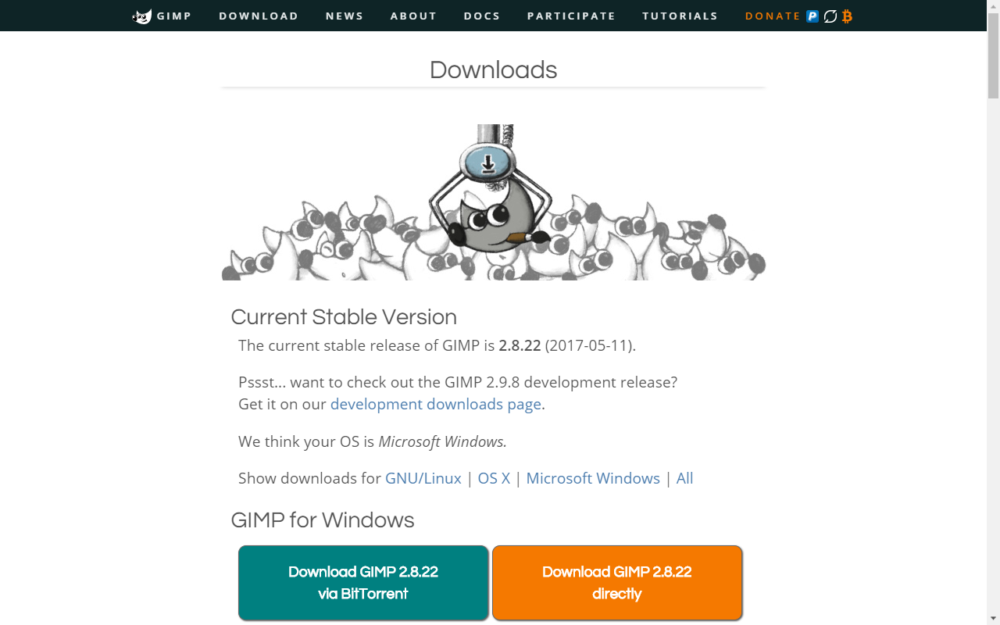

Здесь вам будет предложено загрузить программу установки GIMP для операционной системы, запущенной на вашем компьютере.

1. Нажмите на надпись в оранжевом блоке.
2. Запустите программу установки.
3. Нажмите «Установить».
4. По желанию установите предлагаемую на странице справку на русском языке (`Russian (∀ MB)`) для внутренней помощи по программе без дальнейшего подключения к сети Интернет. [Документация](https://www.gimp.org/docs/).

Стоит отметить, что минимальные системные требования редактора для наших учебных целей весьма демократичные:

| Характеристика | Минимум |
|-|-|
| Платформы | GNU/Linux, macOS, Windows и пр. |
| Разрядность | x86, x64 |
| Процессор | Intel Pentium III или эквивалент |
| Оперативная память | 512 МБ |
| Свободное место на диске | (200 ± 75) МБ |
| Видеоадаптер | любой с поддержкой 3D |
| Видеопамять | 64 МБ |
| Разрешение экрана | 1024×768 |

На первый запуск может понадобиться некоторое время.

## Быстрая загрузка

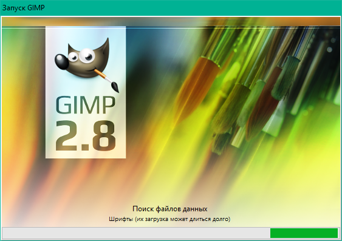

Прежде всего отметим, что обычный запуск GIMP может быть замедлен, потому что происходит загрузка шрифтов. Чтобы избежать её, запускайте программу с флагом `-f`. На следующем снимке приведён пример ярлыка быстрого запуска GIMP, созданного в операционной системе Windows 10.

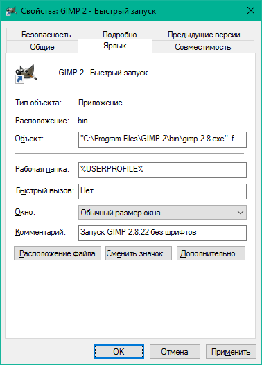

К счастью, даже если отключить загрузку шрифтов, в приложении всегда можно будет просканировать шрифты тогда, когда вам это будет нужно.

## Рабочая область

Запускаем GIMP 2 и видим интерфейс, состоящий из трёх окон. __Окно изображения__ с панелью меню вы видите по центру снимка, а по бокам ― __стыкуемые диалоги__.

### Подготовления

В качестве упрощения, переведём редактор в однооконный режим. Для этого выберите пункт меню __`Окна → Однооконный режим`__. Ещё настроим ширину панели инструментов так, чтобы можно было хорошо рассмотреть нижележащие параметры.

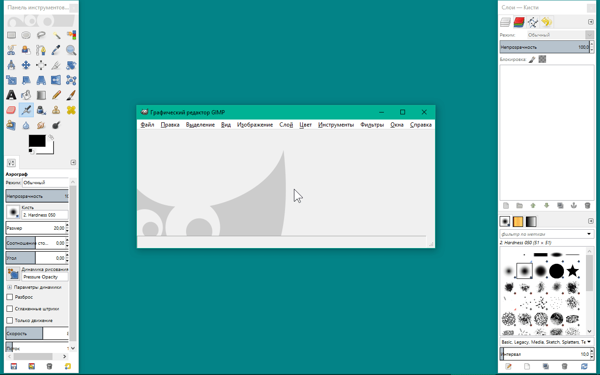

Давайте посмотрим, какие сочетания клавиш работают в программе: выберите пункт меню __`Правка → Комбинации клавиш`__.

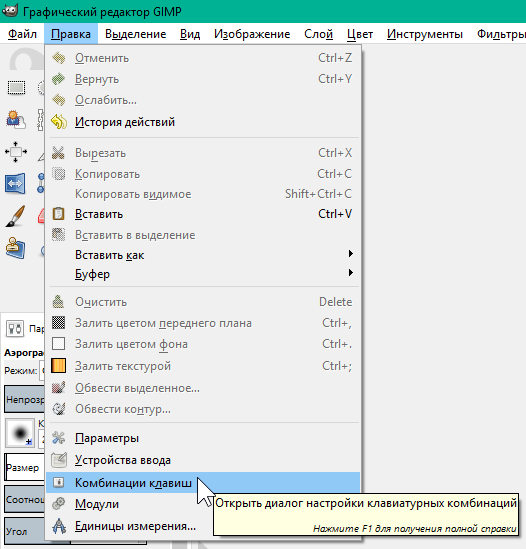

В ответственный момент их знание может здорово помочь. Но воспользоваться ими можно только, если фокусировка установлена в __области изображения__, а не в других панелях. Чтобы сбрасывать фокусировку в область изображения, нажимайте `Esc`.

### Работа со вкладками (стыкуемыми диалогами)

Параметры GIMP, которые предстоит регулярно менять при обработке изображений, вынесены в отдельные вкладки (т. н. «стыкуемые диалоги»). Перечень всех вкладок можно найти в подменю __`Окна → Стыкуемые диалоги`__.

Вкладки можно объединять в панели, которые в свою очередь можно группировать с другими панелями и встраивать в окно изображения (при условии, что редактор в однооконном режиме).

Создадим вкладку для регулировки цветов переднего плана и фона. Обратитесь к одной из панелей: нажмите кнопку с серой стрелкой, а в появившемся меню выберите __`Добавить вкладку → Цвета`__.

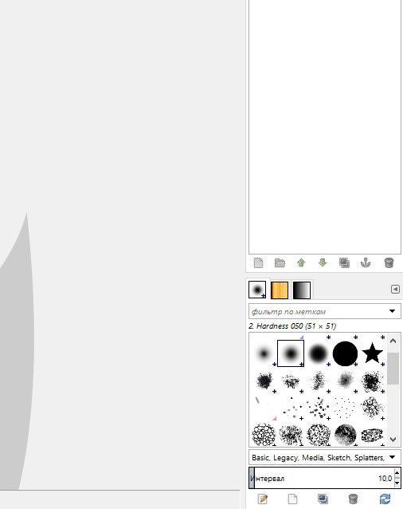

Открытую на панели вкладку можно удалить, выбрав __`Закрыть вкладку`__

## Изображение

Если вы хотите создать новое изображение: нажмите `Ctrl + N` или выберите пункт меню __`Файл → Создать...`__, во всплывающем окне задайте параметры. Размеры, разрешение и фон изображения, в основном, зависят от контекста, в котором оно используется.

Например, если вы создаёте переиспользуемую графику, вам больше понравится наличие альфа-канала на фоне, а потому параметр «__Заполнение__» будет у вас иметь значение __`Прозрачный слой`__, и размер ― чем больше, тем лучше.

Разрешение по осям устанавливается, исходя из требований, предъявляемых к печатному макету: допустим, 300 пикс/дюйм. Если же изображение разрабатывается для электронных носителей информации, то ему часто дают 72 или 96 пикс/дюйм, а разница их отображения, как правило, в обозревателях отсутствует, потому что разрешение в них не учитывается.

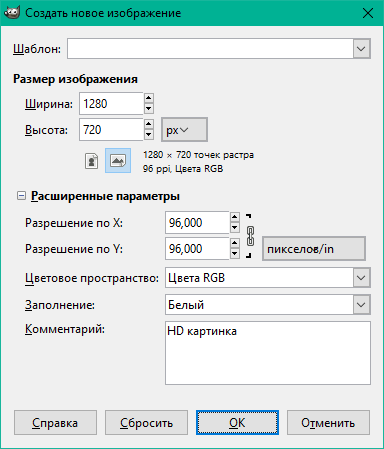

На снимке приведены параметры HD изображения с белым фоном. Будем использовать его для проверки простых инструментов.

### Шаблон создания

Теперь вы можете сохранить новый шаблон через меню __`Файл → Создать шаблон...`__. В него войдут только размер, разрешение, цветовое пространство, заполнение и комментарий. В нашем случае это: `1280×720`, `96 PPI`, `Цвета RGB`, `Цвет фона`, `HD картинка`.

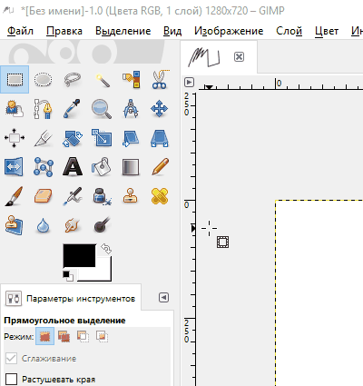

Теперь шаблон можно указать при создании нового изображения, чтобы автоматически вставить нужные значения. Управление шаблонами производится во вкладке __`Шаблоны`__.

### Манипуляции с целым изображением

Попробуйте сместить полотно внутри рабочей области: зажмите колёсико мыши или клавишу `Пробел` и перенесите курсор в другое место.

Теперь создайте копию изображения через меню __`Изображение → Создать копию`__. Сразу под меню у вас появляется второе изображение-проект, которое вы можете закрыть. После копирования история изменений может быть найдена только в исходном проекте.

Вы можете менять размер холста и самого изображения. Меняя __размер холста__, вы добавляете или удаляете пространство ― подобным образом устроены операции кадрирования (`Холст по размеру слоев`, `Откадрировать в выделение` и пр.). Меняя же __размер изображения__, вы его растягиваете в сторону наращивания количества пикселей или их уменьшения.

### Интерполяция

Правило, по которому происходит замена пикселей при растягивании, называется __интерполяцией__. Она применяется во всех деформирующих алгоритмах над слоями и изображением, приводя к сглаживанию растра. Если её отключить, растягивание будет происходить по ближайшему соседу.

В простых случаях используют билинейный фильтр, но бикубический даёт действительно хороший результат. Интерполяцию по Ланцошу (Sinc) хорошо применять для создания высококачественных миниатюр, передающих резкость оригинального изображения. Но помните, что если изображение приходится _увеличивать_, оно уже теряет первозданное качество. Поэтому советуем избегать чрезмерной работы с деформирующими алгоритмами на одном и том же слое.

### Направляющие

Параллельные осям X и Y, вспомогательные прямые, к которым может производиться привязка. Добавьте одну через меню __`Изображение → Направляющие → Создать направляющую...`__, задайте процент от изображения, где следует разместить направляющую, или отведите её с помощью инструмента `Перемещение`. Чтобы удалить направляющую, переместите её на линейку.

## Простые инструменты

Панель инструментов, находящаяся на левой панели, содержит все те же инструменты, что содержатся в меню __`Инструменты`__, за исключением `Операции GEGL` и `Цвета`. Под инструментами видны параметры выбранного инструмента.

###  Карандаш

Инструмент, который резко закрашивает цветом переднего плана все пиксели, попадающие под выбранный мазок кисти. Инструмент хорошо подходит для работы с участками малого размера, где не требуется сглаживание.

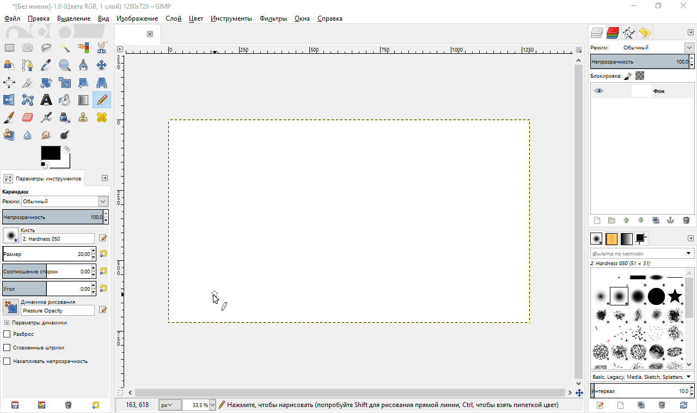

Удерживайте клавишу `Shift`, чтобы проводить прямые следы между точками нажатия левой кнопки мыши (редактор запоминает место последнего мазка). При помощи `Ctrl` можно взять цвет с изображения пипеткой.

Как и для кисти, свойства которой мы ещё рассмотрим, параметрами карандаша служат прозрачность, размер, соотношение сторон, угол, параметры динамики и пр.

###  Масштаб

Инструмент, который приближает и отдаляет изображение и ни на что больше не влияет.

Простое нажатие левой кнопки мыши приводит к кратному масштабированию. Если удержать кнопку мыши и выделить какой-нибудь участок, то масштабирование будет проведено таким образом, чтобы мы могли полностью его разглядеть.

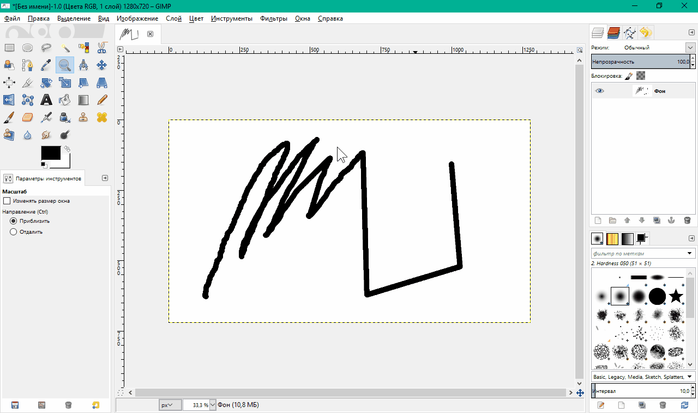

Удерживайте `Ctrl`, чтобы проводить обратную операцию.

При использовании другого инструмента для быстрого масштабирования можно, не переключаясь, зажать клавишу `Ctrl` и вращать колёсико мыши.

Другие возможности масштабирования вы можете найти в меню __`Вид → Масштаб (∀%)`__.

###  Измеритель

Инструмент, который создаёт отрезок и выводит информацию о расстоянии между двумя точками по осям X и Y, углу относительно X.

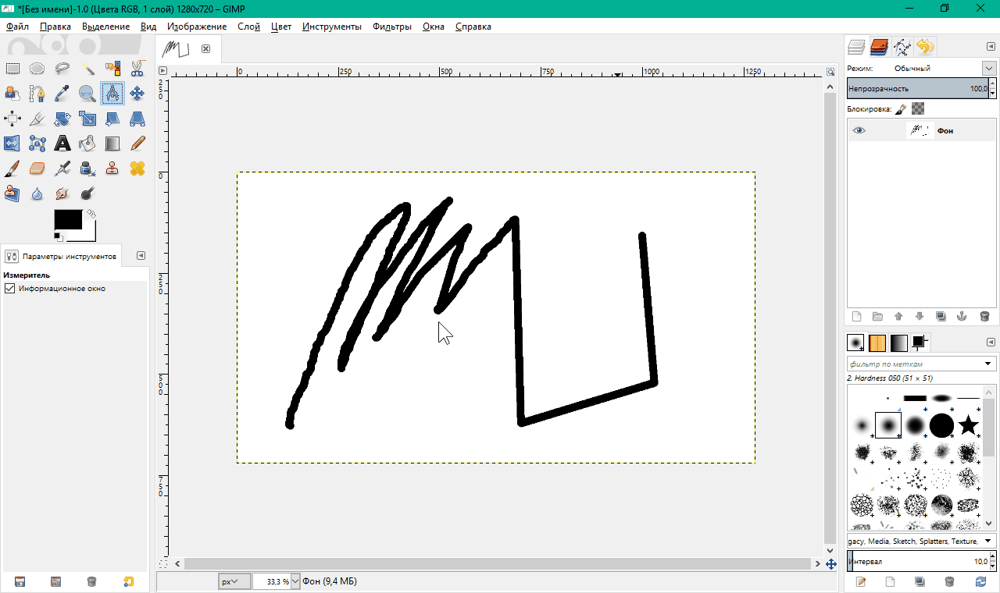

Удерживайте `Ctrl`, чтобы откладывать отрезок под кратным углом. `Alt` позволяет переместить весь отрезок.

_Заметьте, что нужная информация также содержится в строке состояния (в самом низу по середине)._

###  Прямоугольное выделение

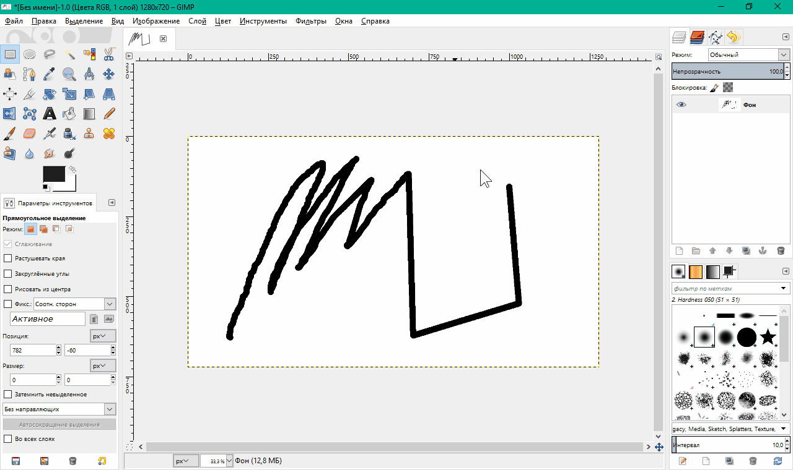

Удерживайте `Shift`, чтобы добавлять выделение (или не удерживайте, чтобы заменить выделение). Используйте `Ctrl`, чтобы убрать часть выделения. На выделении (или его отрицании) по углам и сторонам будут элементы управления, которые позволят изменить позицию и размер выделения. Зажмите `Alt`, чтобы просто перемещать выделение.

Чтобы стереть внутренности выделения, нажмите `Delete`. Также можно проводить иные транформации с выделенным участком слоя.

###  Перемещение

Инструмент, который перемещает объект, находяйщийся под курсором. Тип объекта задаётся в параметрах: слой, выделение, контур.

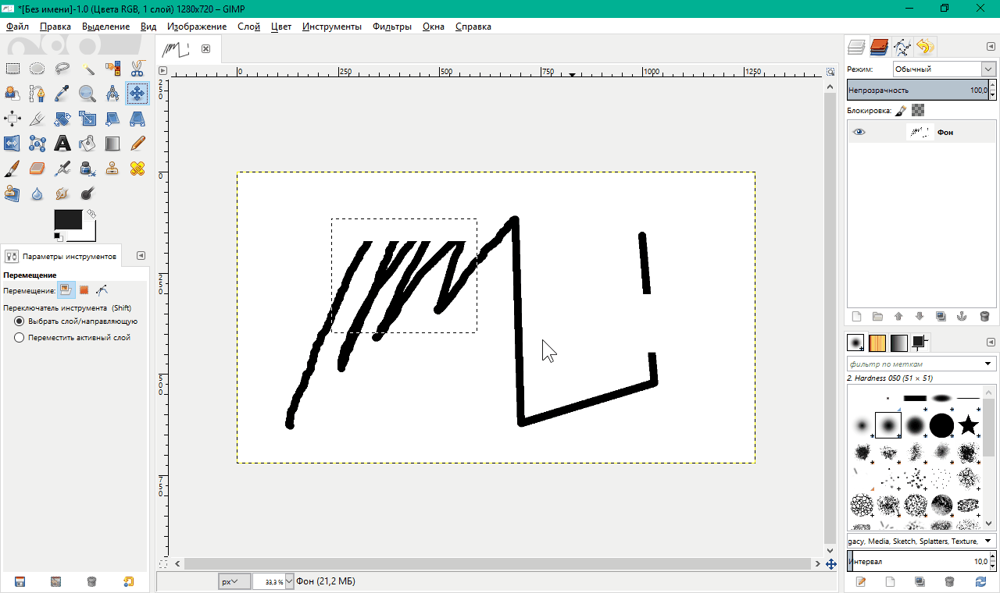

Удерживайте `Shift`, чтобы перемещать активный объект (выделенный в соответствующей вкладке) вне зависимости от того, находится ли он под курсором.

`Shift+Alt` позволяет создать плавающее выделение из текущего слоя.

## Справка

Львиная доля учебно-методического пособия: учебный материал и лабораторные задания. Но иногда появляется необходимость обратиться к официальной документации, которая предоставляется вместе с программным обеспечением, потому что __именно там__ рассмотрены все компонентные составляющие приложения.

- Если вы установили [руководство пользователя](https://www.gimp.org/docs/) на свой компьютер, вы можете воспользоваться помощью по GIMP без подключения к сети Интернет.

- Если вы этого не делали, «Просмотрщик справки GIMP» открывает онлайн-руководство.

Наши тесты показали, что в последних версиях расширение «Просмотрщик справки GIMP» может работать неустойчиво. Поэтому очень советуем вам добавить в закладки своего веб-браузера:

- __[GNU Image Manipulation Program. Руководство пользователя](https://docs.gimp.org/ru/)__.

Если «Просмотрщик справки GIMP» работает хорошо на вашем компьютере, он позволит открыть контекстную помощь _по наведённому пункту меню, инструменту или окну при нажатии `F1`_. В боковом меню можно переключиться на другой раздел справки.

## 📝 Лабораторное задание

Цели выполнения лабораторного задания к __главе 1__:

- открыть изображение, применить на нём недеформирующие преобразования и направляющие;
- найти образцы цветов из палитры «Default» в редакторе палитры образцов и диалоге изменения цвета;
- применить инструменты `Прямоугольное выделение` и `Карандаш`, ровно закрасив прямоугольники;
- сохранить файлы проекта и итогового изображения.

### 🔴 Ход выполнения

#### 1. Изображение

Вам даётся изображение с размытыми прямоугольниками. Вот оно:

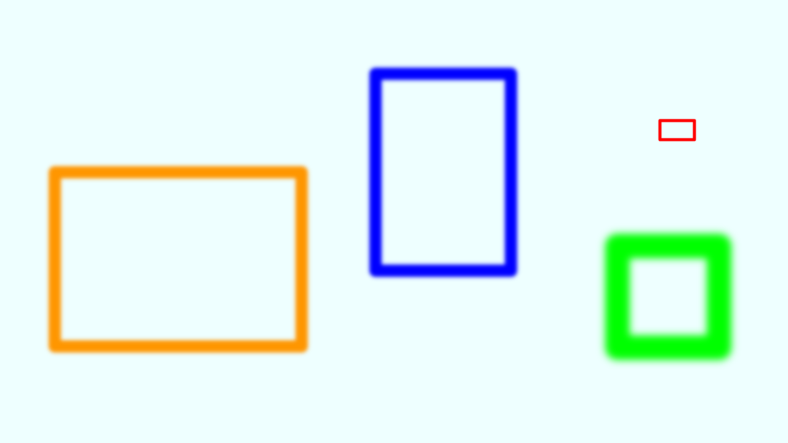

1.1.

Сохраните его на компьютер и откройте в GIMP через меню __`Файл → Открыть...`__ или перенеся его _на панель инструментов_.

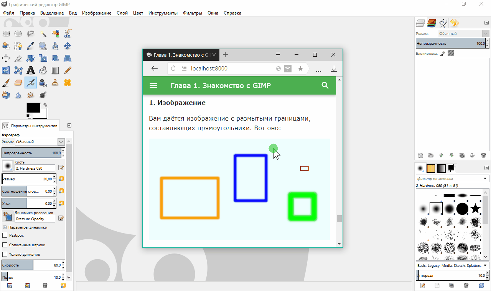

1.2.

Поверните изображение на полоборота, выбрав пункт меню __`Изображение → Преобразования → Повернуть на 180°`__.

1.3.

Обрежьте неиспользуемое пространство между фигурами и холстом с помощью __`Изображение → Усердное кадрирование`__. Под неиспользуемым пространством понимается совокупность диапазонов неизменных пикселей, цвет которых соответсвует вычисленному цвету фона.

1.4.

Создайте 4 направляющие, каждую через меню __`Изображение → Направляющие → Создать направляющую...`__, по следующим параметрам:

| Ориентация | Положение |
|-|-|
| Горизонталь | 375 |
| Горизонталь | 406 |
| Вертикаль | 77 |
| Вертикаль | 133 |

Их пересечение создаёт привязку к обводке красного прямоугольника.

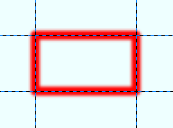

Если что-то неправильно, проверьте пункт 1.3 или 1.2. Отменить прошлое действие можно через меню __`Правка → Отменить[...]`__.

#### 2. Цветовая палитра

Попробуем посмотреть, что из себя представляют цветовые палитры в GIMP, поскольку речь о них пойдёт ещё в следующей главе. По умолчанию у вас выбрана палитра «Default», в которой содержится 23 цвета.

2.1.

Чтобы убедиться в этом, добавьте вкладку `Образцы цветов` и найдите строку `Default (23)` в списке палитр.

2.2.

Откройте редактор палитры образцов двойным щелчком левой кнопки мыши по стандартной палитре.

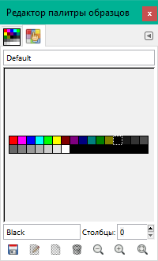

2.3.

Теперь обратитесь к активным цветам: цвет переднего плана и фона. Они видны на панели инструментов. Нажмите на цвет переднего плана (по умолчанию чёрный): откроется диалог изменения цвета. Переключите на пятый способ выбора цвета ― это будут образцы цветов выбранной ранее палитры.

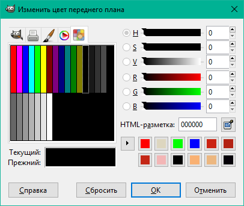

Подобное, при желании, можно повторить со вкладкой `Цвета`, которую мы создали ранее.

#### 3. Простые инструменты

Вам предстоит закрасить все прямоугольники изнутри соответствующими цветами.

3.1.

Возьмите инструмент `Прямоугольное выделение` и выделите им область пересечения направляющих, полученную в пункте 1.4.

3.2.

Не забывайте проверять точность выделения с помощью инструмента `Масштаб`. Можно проводить масштабирование также удерживая клавишу `Ctrl` и вращая колёсико мыши. Для смещения полотна зажмите колёсико мыши или клавишу `Пробел` и отведите мышь в нужную сторону.

3.3.

Инструмент `Прямоугольное выделение`. В параметрах включите режим добавления.

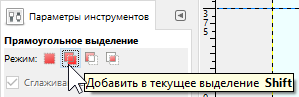

Выделите внутренности остальных прямоугольников, не оставляя на краях интерполирующие пиксели, то есть находя средние (более насыщенные) пиксели контуров. Это такие области, которые будут иметь на краях сплошную цветную рамку:

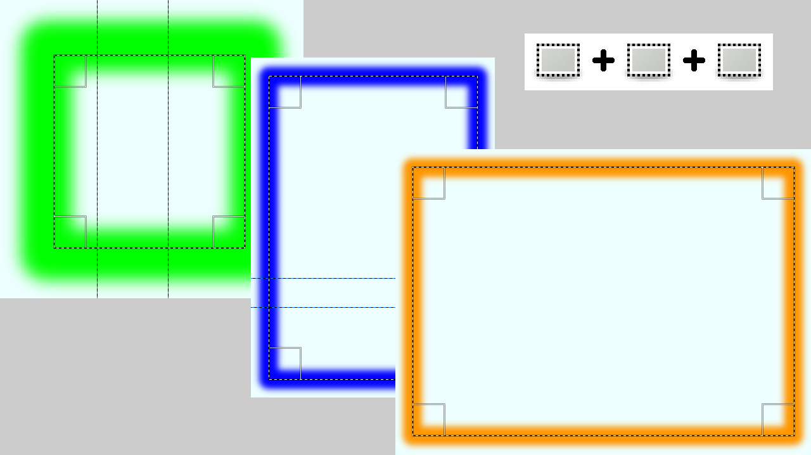

3.4.

Инструмент `Карандаш`. Задайте размер кисти: 100. Выберите цвет образца: красный. Закрасьте прямоугольник одним нажатием: пиксели за пределами выделения затронуты не будут.

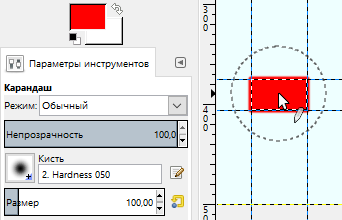

Подобным образом закрасьте соответствующими цветами из палитры зелёный и синий прямоугольники (потребуется несколько мазков).

3.5.

Оранжевого цвета нет в стандартной палитре, поэтому вам нужно снять тот, что есть, инструментом `Пипетка` или, не переключая с `Карандаша`, зажать клавишу `Ctrl`. Нажмите на оранжевый пиксель на краю выделения.

В шестнадцатеричной форме этот цвет должен быть числом `ff9600`. Откройте диалог изменения цвета и проверьте на соответствие этому значению поле `HTML-разметка`.

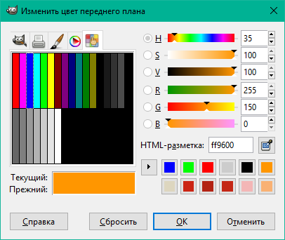

Теперь закрасьте последний прямоугольник этим цветом.

#### 4. Сохранение и экспорт

У GIMP есть собственный открытый формат проектов с расширением `*.xcf`. В нём хранятся все растровые составляющие (слои и каналы), метаданные и история изменений в сжатом виде без потери качества. Всё это позволит вернуться к точке отката или провести манипуляции с отдельными слоями, контурами и т. д.

Чтобы сохранить изображение в распространённых форматах PNG и JPEG, нужно проследовать к его экспорту.

4.1.

Давайте вначале сохраним проект. Для этого выберите __`Файл → Сохранить`__, введите имя файла и нажмите «Сохранить». После этого проект можно перезаписывать, каждый раз выбирая в меню __`Файл → Сохранить`__, если вы внесли какие-либо изменения.

4.2.

Теперь сохраним изображение в формате PNG. Откройте __`Файл → Экспортировать как...`__, введите имя файла и добавьте в конце `.png`. Как правило, расширение уже стоит, и вам только остаётся ввести имя файла. При нажатии кнопки «Экспортировать» появятся настройки для выбранного формата изображения. Чтобы не терять в качестве, степень сжатия PNG установите на `0` (но для большинства изображений можно оставить значение больше).

Получим нечто такое:

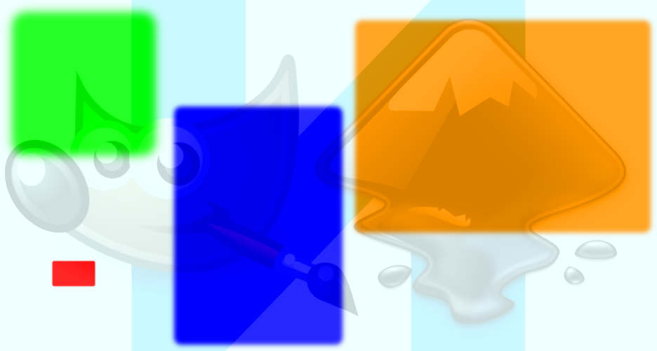

Мы подумали, что водяной знак пригодится. Вам его добавлять не нужно. ☺