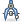

# Глава 1. Знакомство с GIMP

GIMP ― растровый графический редактор с открытым исходным кодом.

## Установка

Приложение может быть найдено на [официальном сайте GIMP](https://www.gimp.org/). Перейдём в раздел [«Downloads»](https://www.gimp.org/downloads/).

Здесь вам будет предложено загрузить GIMP для операционной системы, запущенной на вашем компьютере.

1. Нажмите на надпись в оранжевом блоке.
2. Запустите программу установки.
3. Нажмите «Установить».
4. По желанию установите предлагаемую на странице справку на русском языке (`Russian (∀ MB)`) для использования помощи без дальнейшего подключения к сети Интернет.

На первый запуск может понадобиться некоторое время.

## Быстрая загрузка

Прежде всего отметим, что обычный запуск GIMP может быть замедлен, потому что происходит загрузка шрифтов. Чтобы избежать её, запускайте программу с флагом `-f`. На следующем снимке приведён пример ярлыка быстрого запуска GIMP, созданного в ОС Windows.

К счастью, даже если отключить загрузку шрифтов, в приложении всегда можно будет просканировать шрифты тогда, когда вам может понадобиться работа с текстом.

## Рабочая область

Запускаем GIMP 2 и видим интерфейс, состоящий из трёх окон. __Окно изображения__ с панелью меню вы видите по центру снимка, а по бокам ― __стыкуемые диалоги__.

### Подготовления

В качестве упрощения, переведём редактор в однооконный режим. Для этого выберите пункт меню __`Окна → Однооконный режим`__. Ещё настроим ширину панели инструментов так, чтобы можно было хорошо рассмотреть нижележащие параметры.

Давайте посмотрим, какие сочетания клавиш работают в программе: выберите пункт меню __`Правка → Комбинации клавиш`__.

Не исключаются такие случаи, когда комбинации клавиш могут не работать, но в ответсвенный момент их знание может здорово помочь.

### Работа со вкладками (стыкуемыми диалогами)

Параметры GIMP, которые предстоит регулярно менять при обработке изображений, вынесены в отдельные вкладки (т. н. «стыкуемые диалоги»). Перечень всех вкладок можно найти в подменю __`Окна → Стыкуемые диалоги`__.

Вкладки можно объединять в панели, которые в свою очередь можно группировать с другими панелями и встраивать в окно изображения (при условии, что редактор в однооконном режиме).

Создадим вкладку для регулировки цветов переднего плана и фона. Обратитесь к одной из панелей: нажмите кнопку с серой стрелкой, а в меню выберите __`Добавить вкладку → Цвета`__.

Открытую на панели вкладку можно удалить, выбрав __`Закрыть вкладку`__

## Изображение

Если вы хотите создать новое изображение: нажмите `Ctrl + N` или выберите пункт меню __`Файл → Создать`__, во всплывающем окне задайте параметры. Размеры, разрешение и фон изображения, в основном, зависят от контекста, в котором оно используется.

Например, если вы создаёте переиспользуемую графику, вам больше понравится наличие альфа-канала на фоне, а потому параметр «__Заполнение__» будет у вас иметь значение __`Прозрачный слой`__.

Разрешение по осям устанавливается, исходя из требований, предъявляемых к печатному макету: допустим, 300 пикс/дюйм. Если же изображение разрабатывается для веб-окружения, то ему часто дают 72 или 96 пикс/дюйм, потому что отсутствует размерная разница в их отображении на электронных устройствах.

На снимке приведены параметры HD изображения с белым фоном. Будем использовать его для проверки простых инструментов.

## Простые инструменты

Панель инструментов, находящаяся на левой панели, содержит все те же инструменты, что содержатся в меню __`Инструменты`__, за исключением `Операции GEGL` и `Цвета`. Под инструментами видны параметры выбранного инструмента.

###  Карандаш

Инструмент, который резко закрашивает цветом переднего плана все пиксели, попадающие под выбранный мазок кисти. Инструмент хорошо подходит для работы с участками малого размера, где не требуется гладкость.

Удерживайте клавишу `Shift`, чтобы проводить прямые следы между точками нажатия левой кнопки мыши (редактор запоминает место последнего мазка). При помощи `Ctrl` можно взять цвет с изображения пипеткой.

Как и для кисти, свойства которой мы ещё рассмотрим, параметрами карандаша служат прозрачность, размер, соотношение сторон, угол, параметры динамики и пр.

###  Масштаб

Инструмент, который приближает и отдаляет изображение и ни на что больше не влияет.

Простое нажатие левой кнопки мыши приводит к кратному масштабированию. Если удержать кнопку мыши и выделить какой-нибудь участок, то масштабирование будет проведено таким образом, чтобы мы могли полностью его разглядеть.

Удерживайте `Ctrl`, чтобы проводить обратную операцию: когда в параметрах инструмента выбрано `Приблизить`, инструмент будет отдалять изображение, в другом случае будет приближать.

Другие возможности масштабирования вы можете найти в меню __`Вид → Масштаб (∀%)`__.

###  Измеритель

Инструмент, который создаёт отрезок и выводит информацию о расстоянии между двумя точками по осям X и Y, угле относительно X.

Удерживайте `Ctrl`, чтобы откладывать отрезок под кратным углом. `Alt` позволяет переместить весь отрезок.

_Заметьте, что нужная информация также содержится в строке состояния (в самом низу по середине)._