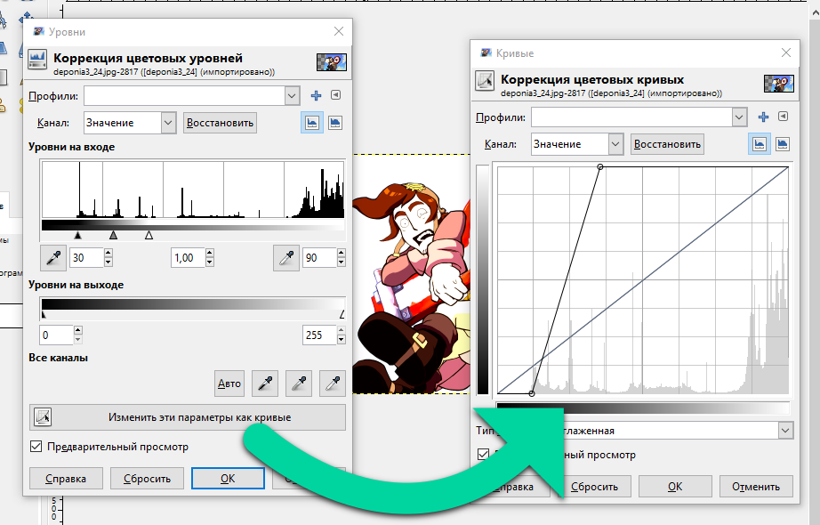
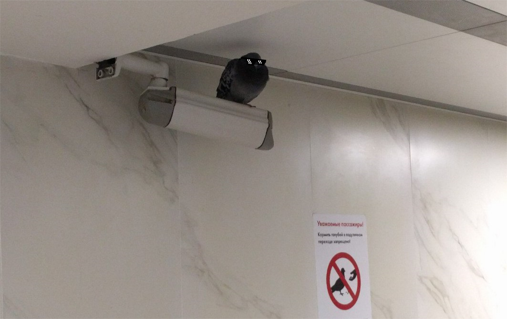
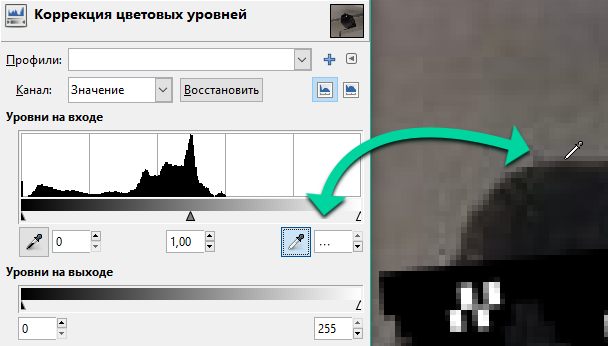
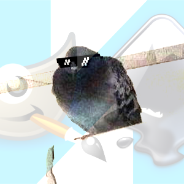
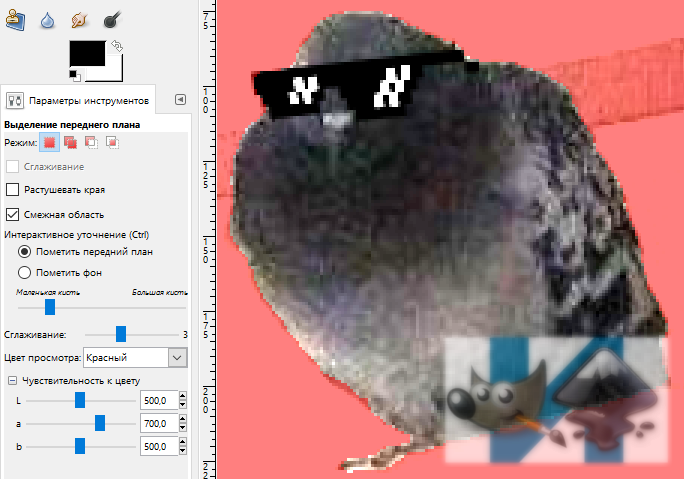
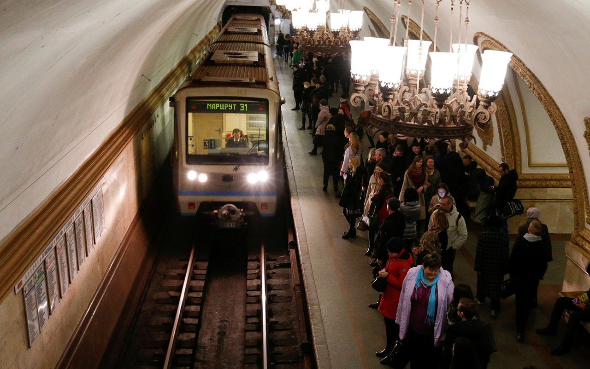
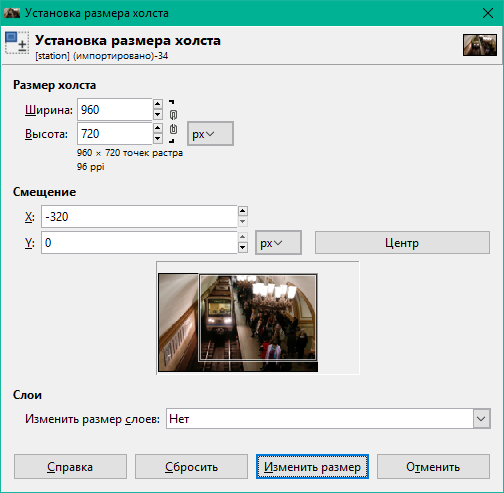
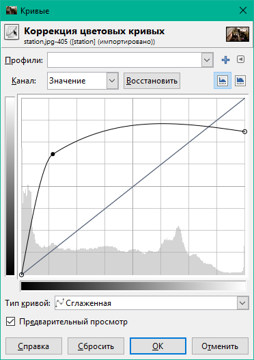
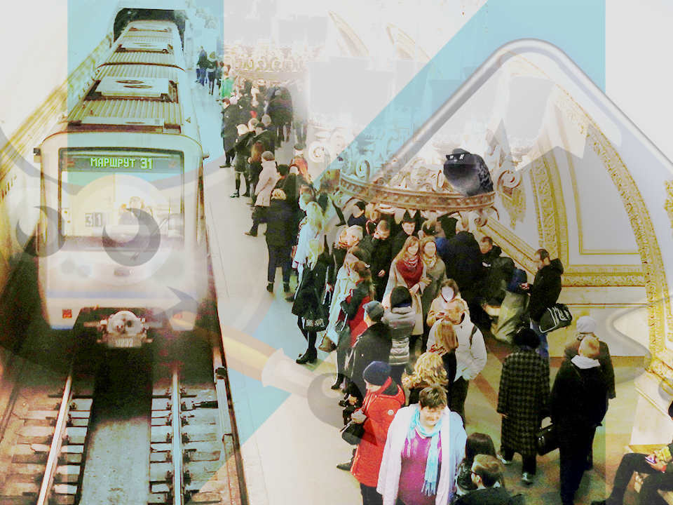

# Глава 2. Цвета

Было бы пренебрежительно не рассмотреть применение цветов конкретно в GIMP. Мы научимся выбирать цвет любым способом, варьировать уровнями и каналами цветопередачи, а также выделять передний план.

## Активные цвета

Вы могли заметить большие чёрный и белый прямоугольники на панели инструментов. Они указывают на активные цвета: цвет __переднего плана__ и __фона__. Их можно менять местами по нажатии на стрелку. Возвращает цвета по умолчанию кнопка с чёрным и белым квадратами.

Цвет переднего плана служит главным цветом, который используется многими инструментами: `Карандаш`, `Кисть`, `Аэрограф`, `Перо`, `Текст`. Ещё, например, только этим цветом можно сделать обводку по контуру или выделению.

Цветом фона можно производить очистку выделенной области слоя, если в нём нет альфа-канала (фотографии, JPEG-изображения). С инструментом `Заливка` можно сделать заливку цветом, обратным выбранному в параметрах, удерживая клавишу `Ctrl`.

## Способы выбора цвета

### Шкала

Пожалуй, самый точный способ выбора цвета, когда вы знаете, какие значения должны быть у составляющих. Шкала может быть найдена в диалоге изменения справа или во вкладке `Цвета` как 6-й способ выбора.

Именно составляющие `R`, `G` и `B` (сокращённо __RGB__, расшифровывается как «красный, зелёный, синий») стоят за профилем цветопередачи цифровых изображений и каждая принимает диапазон 0—255.

`H`, `S`, `V` расшифровываются как «тон», «насыщенность» и «значение». Они служат производными характеристиками цвета. Тон принимает диапазон 0—360, насыщенность и значение ― 0—100.

### Пипетка и цветовой код

Из экрана можно извлечь нужный цвет с помощью пипетки. Её можно найти рядом с цветовым кодом (см. поле `HTML-разметка`).

Цветовой код представляет собой шестиразрядное число, обозначающее цвет в шестнадцатеричной форме. В это поле можно вставить цветовой код, полученный в другой программе. Также можно использовать сокращённую трёхразрядную запись. Вот примеры некоторых цветов:

|| сокр. код | R | G | B |
|-|-:|-:|-:|-:|
| чёрный | `000` | 0 | 0 | 0 |
| красный | `f00` | 255 | 0 | 0 |
| жёлтый | `ff0` | 255 | 255 | 0 |
| зелёный | `0f0` | 0 | 255 | 0 |
| циановый | `0ff` | 0 | 255 | 255 |
| синий | `00f` | 0 | 0 | 255 |
| фуксия | `f0f` | 255 | 0 | 255 |
| белый | `fff` | 255 | 255 | 255 |

### HSV/RGB

Такой выбор наиболее распространён, позволяет отделить главную составляющую от комбинируемых в градиент. Главную можно выбрать на шкале или нажав соответствующую кнопку во вкладке `Цвет`.

<video src="../video/hsv-rgb-selection.mp4" loop></video>

### CMYK

Четырёхцветная автотипия CMYK, в основном, используется в полиграфии. Её цветовой охват ниже, чем у RGB. Разные цвета в ней получаются путём смешения четырёх красок: циановой, мадженты, жёлтой и чёрной. Данный способ выбора цвета помогает выбрать цвета, которые коррелируют с печатным оттиском.

### Акварель

Как выбрать цвет способом акварельной кисти? Установите давление на кисть ползунком справа, затем зажмите левую кнопку мыши на спектре. Проводите курсор по нужным вам цветам, словно мы смешиваете акварельные краски. Если вы получили слишком тёмный цвет, зажмите правую кнопку мыши (не отпуская левую), чтобы добавить белизны.

<video src="../video/watercolour-selection.mp4" loop></video>

### Круг

Во внутреннем треугольнике вы задаёте насыщенность и яркость. На кольце выберите нужный тон.

<video src="../video/circle-selection.mp4" loop></video>

### Палитра

То, через что мы проходили в задаче 2 [главы 1](1.md): по умолчанию задана палитра `Default`, которая содержит основные 23 цвета, включая: перечисленные в таблице с цветовыми кодами цвета, полутёмные версии насыщенных из них и 9 градаций серого. Выбор палитры во вкладке `Образцы цветов` приводит к немедленной смене образцов.

<video src="../video/palette-selection.mp4" loop></video>

## Каналы изображения

Пиксели из составляющих RGB полноцветного изображения разделены между каналами «Красный», «Зелёный» и «Синий». Скрытие каналов уменьшает яркость изображения.

<video src="../video/channels.mp4" loop></video>

Четвёртый канал присутствует в изображениях формата PNG и GIF, он называется «Альфа» (канал видимости). В непрозрачных изображениях альфа-канал полностью «белый» или отсутсвует, что означает видимость всего. Добавим в наше открытое изображение альфа-канал через меню __`Слои → Прозрачность → Добавить альфа-канал`__.

<video src="../video/add-alpha-channel.mp4" loop></video>

Как видите, шахматный фон символизирует прозрачность, а альфа-канал в этой области становится «чёрным». Значение видимости пикселей варьируется от 0 до 100.

## Цветовые эффекты

В следующем видео показано действие основных цветовых эффектов.

<video src="../video/color-effects.mp4" loop controls></video>

__Уровни__ и __Кривые__. Не случайно мы ставим их в один ряд: оба эффекта работают со значениями и каналами в похожей манере. Выделенные уровни на входе, гамма-коэффициент и уровни на выходе можно преобразовать в кривую нажатием кнопки «Изменить эти параметры как кривые».

С помощью кривых можно настроить несколько каналов в один проход, экспериментируя с расположением вершин. Сбросить кривую выбранного канала можно нажав «Восстановить».

Остальные цветовые эффекты верхнего меню также оперируют цветовыми кривыми, но в своей манере.

- Например, __Яркость-Контраст__ использует понятия «яркость» и «контраст» для упразднения уровней и кривых (где требовалось регулировать определённые ползунки или узлы).
- С помощью __Цветового баланса__ можно выбрать диапазоны изменения уровней по значению: тени, полутона, светлые части.
- __Тон-Насыщенность__ может менять шесть основных цветов по-отдельности, придавая им другие тон, освещённость и насыщенность.
- __Тонирование__ целиком меняет тон изображения/слоя, делая его монохромным.
- __Постеризация__ уменьшает количество цветов у изображения/слоя.
- __Обесцвечивание__: оно позволяет заменить изображение на одну из его трёх основ оттенков серого (по умолчанию можно выбрать за основу освещённость).
- __Порог__ округляет значения пикселей для получения строгих чёрного и белого.

## Выделение переднего плана

Представим на минуту, что нам понравилась некая конструкция и мы бы хотели убрать фон из под неё. Вот как мы это сделаем:

<video src="../video/foreground-selection.mp4" loop controls></video>

- Берите инструмент `Выделение переднего плана`.
- Выделите рабочую зону: просто добавьте её вершины нажатием левой кнопки мыши и замкните с первой точкой. После этого появится маска _просмотра_, которая поможет отличить выделенную область. Она будет того цвета, который указан в параметре «Цвет просмотра»: установите контрастный фону.
- Подберите удобный размер кисти в разделе параметров «Интерактивное уточнение». Установите курсор на основании объекта, который вы хотите выделить.
- Пометьте передний план, зажав левую кнопку мыши и осторожно проводя кистью вдоль объекта, не задевая фон, захватите __цвета объекта__. Если их будет отмечено достаточно или нет другого пути, отпустите кнопку мыши.
- Повторите это там, где часть объекта ещё визуально не отделена от фона (вероятно, там используются другие цвета, проверьте чувствительность к цвету).
- Если вы случайно задели фон или остались его артефакты, удерживайте клавишу `Ctrl`, чтобы помечать фон. Проведите в местах, не принадлежащих объекту.
- Нажмите `Enter` ― выделение готово. Если надо, скопируйте объект через меню __`Правка → Копировать`__ и используйте в своей графике.

У инструмента `Выделение переднего плана` есть следующие параметры из раздела `Чувствительность к цвету`: «L» ― чувствительность к яркости, «a» ― красному и зелёному, «b» ― жёлтому и синему. Вы можете заметить, что в примере мы установили «b» = `596`, т. е. значение более чем в 2 раза большее стандартного. Объясним это тем, что цвет фона был небесным, и конструкция тоже имеет этот оттенок, а именно __чувствительность к оттенку__, близкому к синему, помогла выделить более-менее аккуратную область объекта, исключив напоминание о фоне.

Данный способ выделения не самый идеальный, поскольку после него остаются острые края. В примере мы решили уменьшить размер изображения сразу после извлечения объекта, применив интерполяцию Ланцоша, при которой пропадают артефакты на краях.

Это один из случаев, доказывающих необходимость большого разрешения при фотосъёмке. Можете потренироваться на других фотографиях: [красивые, бесплатные снимки Unsplash](https://unsplash.com/). Там они все высокого качества.

Только помните, что если у вашего компьютера довольно слабая вычислительная мощность, то использовать инструмент `Выделение переднего плана` лучше на уменьшенном изображении (до 2000 пикс по ширине и высоте), поскольку программа будет тормозить при размерах больше.

---

## 📝 Лабораторное задание

Цели выполнения лабораторного задания к __главе 2__:

- отразить и обрезать данное изображение так, чтобы указанный объект присутствовал в кадре, применить цветокоррекцию уровней на входе и не забыть сохранить;
- выполнить выделение переднего плана, а именно указанного объекта по отличающемуся контуру, скопировать содержимое выделения;
- сделать коллаж с определённым освещением из предоставленного фона и скопированного объекта, сохранить проект.

### 🔴 Ход выполнения

#### 1. Портрет

На территории метрополитена поселился очень гордый голубь. Давайте сделаем его портрет из этого изображения:

1.1.

Отразите изображение по горизонтали.

1.2.

Выделите область размером 300×300 пикс так, чтобы птица в неё вместилась. Откадрируйте в неё изображение.

1.3.

Попробуйте понять по снимку, что мы хотим от вас:

Примените цветовой эффект, чтобы получить нечто наподобие этого:

Да, мы снова поставили водяной знак на рисунок. ☺

1.4.

Сохраните свой проект в формате XCF.

#### 2. Передний план

Теперь вам нужно будет отделить голубя от фона.

2.1.

Создайте копию портрета.

2.2.

Сделайте как можно более достоверное выделение птицы, используя `Выделение переднего плана`, в котором не должно остаться артефактов фона. Установите значения чувствительности к цвету, как показано на снимке (или как считаете нужным):

__Не переключайте инструмент__, иначе рискуете потерять время на воссоздание. `Выделение переднего плана` можно сравнить с `Контуром`, ведь последний сохраняется в проекте сразу во время откладывания узлов.

__Если готово, нажмите `Enter`.__

2.3.

Скопируйте выделенную область через __`Правка → Копировать`__.

#### 3. Коллаж

Откройте фон:

3.1.

Обрежьте его так, как показано на снимке:

3.2.

Ограничьте просвет ламп, но при этом сделайте фон в целом насыщенным, откорректировав кривую значений примерно таким образом:

3.3.

Выберите __`Правка → Вставить как → Новый слой`__. Должен появиться голубь в левой верхней части полотна.

3.4.

Уменьшите птицу: __`Слой → Размер слоя...`__. Прежде всего, замкните «цепь» справа от размеров. Это позволит выставить размеры в изначальной пропорции. Установите высоту `75` и примените.

3.5.

Переместите птицу на светильник. Здорово смотрится, не так ли?

В конце задания сохраняйте проект. Не перезаписывайте проект с голубем 300×300 пикс, он может пригодиться.