# Глава 2. Форматы изображений

GIMP может управлять более 40 форматами файлов
для представления изображений. Он может читать 35 входных 
форматов данных и генерировать 39 выходных форматов. Более того,
он принимает эти форматы в сжатом виде, используя методы сжатия Gzip или Bzip2.
Если мы будем подробно рассматривать все эти форматы,
глава будет огромной. Вместо этого мы рассмотрим
только популярные или, по крайней мере,
полезные многим пользователям GIMP форматы. Мы также обсудим
общие принципы, которые регулируют различные форматы изображения.

# Обзор файловых форматов 

Изображение на экране компьютера состоит из
матрицы пикселей. Это справедливо для всех дисплеев, 
использующихся в настоящее время: мониторы на основе 
электронно-лучевой трубки, плазменные, жидкокристаллические
и другие. Это справедливо и для лазерных, и
струйных принтеров. Даже глаз разбивает изображения
в массив палочек и колбочек.
Формат файла - это то, как файл хранится в памяти; 
он не зависит от того, как было зафиксировано изображение
и как оно будет рассматриваться в конечном итоге. Так,
представление изображения в виде файла, независимо от того,
хранится ли он на диске или загружается через Интернет, не обязательно является
представлением конечной матрицы
пикселей. И поскольку плотность пикселей варьируется в широких пределах
среди дисплеев мобильных телефонов, компьютерных мониторов,
дешевых струйных принтеров и профессиональных
лазерных принтеров, любое представление должно быть
преобразовано из внутреннего представления во
внешнее. Фотографии, которые вы сделаете,
также должны иметь возможность преобразования - будь то с камеры телефона
или с профессиональной цифровой камеры.

## Растровые и векторные форматы

Форматы изображений можно разделить на два основных семейства:
растровое и векторное.
• В растровых форматах изображение сохраняется как
представление пикселей, которые оно содержит.
Растровое изображение, которое может состоять только из черных и белых
пикселей (без уровней серого), содержит 1 бит на
пиксель, тогда как пиксельное изображение, которое может включать себя ещё и 
уровни серого цвета, содержит несколько
бит на пиксель.
• В векторных форматах изображение сохраняется как
геометрическое описание его содержимого.
Каждый формат имеет свои преимущества и недостатки.
Файл изображения в векторном формате обычно
намного меньше, чем файл в растровом формате, а векторное изображение будет отображаться в любом размере
с той же резкостью, поскольку положение пикселей
вычисляется каждый раз при изменении коэффициента масштабирования.
На рисунке 20.1 показан значок 48 × 48, сгенерированный как
векторное графическое изображение.

На рисунке 20.2 показан тот же значок, увеличенный до
480 × 480 в векторном формате при разрешении 300 dpi. 

Рисунок 20.3 показывает тот же значок, увеличенный как растровое графическое изображение.

Хотя векторная графика явно имеет свои преимущества,
их главный недостаток - они не могут точно отображать сложные изображения, 
такие как фотографии. Например, описание рельефа
и затенение человеческого лица с помощью математической
формулы невозможны. Рисунок 20.4 является типичным
пример портрета, выполненного в векторной графике.

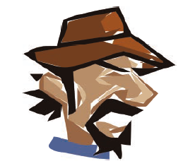

Хотя доступны инструменты для преобразования
изображения из растрового формата в векторный,
результаты, как правило, плохие.
GIMP работает над растровым представлением
изображений, поэтому в нём хорошо работать с фотографиями и
иллюстрациями. Вы всегда можете уменьшить размер растрового изображения до его 
отправки кому-либо или загрузкой в интернет, в отличие от векторного изображения.

## Сжатие с потерями и без потери качества 

Растровые изображения обычно большие, и их качество растёт по мере улучшения цифровых камер.
Размер данных одного пикселя также увеличивается, когда
количество цветов, которые могут быть им представлены - растёт.
И само число пикселей тоже увеличивается вместе с
размером и разрешением изображения. Цифровые
камеры теперь могут создавать изображения размером до 10 (или
даже 12) миллионов пикселей, что обычно означает, что они занимают
не менее 30 МБ, если количество цветов в каждом канале
256.
Файл размером 30 МБ довольно велик даже для текущих
жестких дисков, особенно если вы храните много фотографий.
Этот размер файла также велик для большинства карт памяти 
из чего следует, что могут возникнуть трудности при отправке по
электронной почте или при публикации в Интернете. Одним из решений этой проблемы является сжатие изображений,
чтобы уменьшить их размер. Для сжатия файлов доступен ряд алгоритмов, особенно если эти файлы - изображения.
Сжатие может осуществляться с или без потерь.
• Алгоритм сжатия без потерь восстанавливает
исходные данные без потери информации.
Качество изображения остается стабильным, но иногда
исходное изображение преобразуется в
с потерями. Если изображение сначала не преобразуется,
то применение сжатия без потерь не уменьшит
размер файла очень сильно.
• Алгоритм сжатия с потерями приводит к некоторым
потерям информации, но различия могут
быть невидимы для человеческого глаза. В общем,
сжатие с потерями значительно уменьшает размер файла,
но вы не сможете восстановить оригинал
изображения; если вы применяете подобный алгоритм более одного раза, ухудшение
является кумулятивным (накапливается). Вскоре несложно будет увидеть разницу.
Если вы хотите получить максимальное качество изображения и не
заботиться о размере, используйте только сжатие без потерь.
Если вы можете принять некоторые потери в качестве изображения в
обмен на значительное уменьшения размера, выберите
алгоритм с потерями. Рисунок 20.5 показывает одно и то же изображение девять раз.

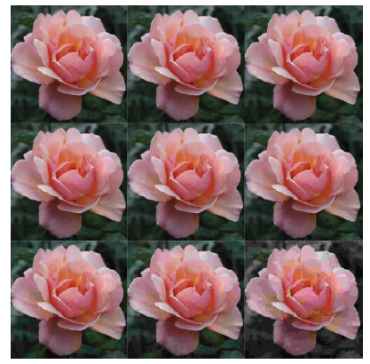

На рисунке 20.6 показана зависимость коэффициента качества (factor) и размера изображения (size).

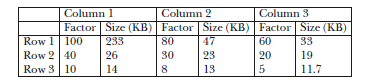

Вы не увидите очевидной потери качества 
вплоть до значения коэффициента равного 60.
Еще одной проблемой сжатия с потерями является то,
что дефекты накапливаются, если вы повторяете сжатие и сохраняете изображение
несколько раз. Рисунок 20.7 (слева) показывает увеличенный
раздел розового фото и рисунок 20.7
(справа) показывает ту же фотографию после сохранения и
сжатия его несколько раз с низким коэффициентом качества
(менее 60). Артефакты сжатия
хорошо видны на краю среднего лепестка.

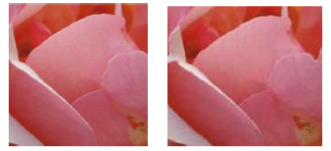

## Механизмы компоновки и браузеры

В эти дни многие люди просматривают изображения через
браузеры, такие как Firefox или Internet Explorer. К сожалению,
не все форматы изображений поддерживаются
всеми браузерами. Фактически, три общих формата,
обсуждаемых в следующем разделе, являются единственными,
которые отображаются всеми существующими браузерами, но иногда даже эти форматы не работают совершенно.
Существует много разных браузеров, и некоторые
браузеры различаются в зависимости от вашей операционной
система. Браузеры используют механизмы компоновки для отображения
изображения на экране. Существует менее 10 доступных механизмов компоновки и только несколько из них
используются широко. Различные браузеры, использующие одинаковые
компоновщики, обрабатывает изображения одним и тем же образом.

# JPEG, GIF и PNG

В этом разделе мы обсудим общие форматы,
обрабатываемые всеми механизмами компоновки (хотя и не всегда
хорошо). Они, как правило, являются наиболее полезными.

## JPEG

Удивительно, но JPEG является не именем формата (он называется JFIF), а рабочей группы,
которая создала его - Joint Photographic Experts
Group. Этот комитет определил, что станет стандартом
ISO в 1994 году. Формат, который они разработали,
является стандартным форматом изображений большинства, если не всех, цифровых
камер.
JPEG использует алгоритм сжатия с потерями,
что означает, что некоторая информация теряется, но
размер файла существенно уменьшается при сохранении
довольно высокого качества изображения. JPEG - это
формат выбора для фотографий и цифровых
иллюстраций, поскольку он может представлять сложные изображения
как файлы, которые достаточно малы для отправки посредством
электронной почты или для публикации в Интернете.
Как показано на рисунке 20.7, сжатие JPEG
снова и снова не является хорошей идеей, поскольку
количество потерь растёт. Поэтому в GIMP всегда работайте с изображениями в формате XCF, а затем 
экспортируйте их из XCF для сохранения
как JPEG. Этот вопрос является одной из причин, почему,
начиная с версии 2.8, GIMP экспортирует изображения только 
как JPEG-файлы и не считает их
сохраненными, пока вы не сохранили их как файл XCF. Формат JPEG не подходит для изображений
содержащих чертежи, текст или резкий
контраст между соседними пикселями. В этом случае необходим алгоритм сжатия без потерь,
потому что это означает, что только некоторые пиксели из
начального изображения сохраняются, а отсутствующие пиксели
интерполируются при его загрузке. Если пиксели
вдоль резкой границы на чертеже линии не
сохранены, интерполяция присваивает им среднее значение, 
основанное на окружающих пикселях; в результате, граница сглаживается
и изображение может получиться слишком размытым.
На рисунках 20.8 и 20.9 показана разница
между алгоритмами сжатия с потерями и без потерь на изображении с высокой контрастностью.

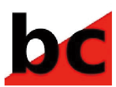

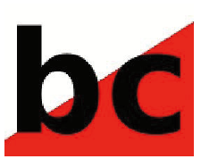

На первом рисунке контуры символа
размыты алгоритмом сжатия с потерями, тогда как на втором рисунке они остаются острыми,
благодаря алгоритму сжатия без потерь.
Еще одна слабость формата JPEG заключается в том, что
он не может справиться с прозрачностью. Хотя в целом он 
отлично подходит для фотографий, если вы хотите отображать непрямоугольные.
Например, на веб-странице, вам нужно заполнить фон
с цветом или рисунком.
Файл JPEG может содержать цветовой профиль ICC,
который определяет используемое цветовое пространство. Если это так, когда вы загружаете файл,
GIMP спрашивает, хотите ли вы использовать встроенный
профиль. Как правило, вы должны ответить «да».
Многие простые приложения для изображений просто игнорируют
профиль.

### Экспорт в JPEG

При экспорте изображения в JPEG (.jpeg или
.jpg), GIMP открывает диалог, который в своей простейшей
форме позволяет только устанавливать качество сжатия [от 0 до 100].
Ползунок QUALITY определяет, насколько
качество изображения будет снижено. Изображения со значениями больше 85
выглядят одинаково, потери качества практически
неразличимы при таких значениях. Деградация
обычно становится очевидной, если значение
менее 50. Нажмите SHOW PREVIEW IN IMAGE
WINDOW, чтобы увидеть эффект текущей настройки
перед экспортом изображения.
Если вы нажмете ADVANCED OPTIONS, вы увидите
расширенный диалог, показанный на рисунке 20.10.

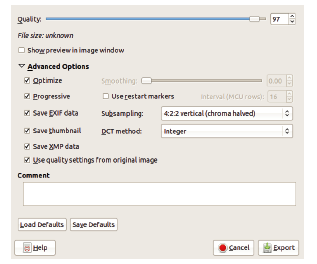

Вот наиболее полезные ADVANCED OPTIONS:
• PROGRESSIVE: файл постепенно загружается на 
веб-страницу. Этот параметр полезен для больших файлов, которые
неизбежно требуют время для загрузки, но он немного увеличивает
размер файла.
• SAVE EXIF DATA: данные EXIF, которые
обычно добавляется в файл цифровыми камерами,
содержат информацию о фотографии, в том числе
дату и время, когда была сделана фотография,
марки и модели камеры, а также используемые настройки камеры.
• SAVE THUMBNAIL: этот параметр сохраняет миниатюру
изображения в файле.
• USE QUALITY SETTINGS FROM ORIGINAL IMAGE:
Эти параметры определяют, как работает алгоритм сжатия. Исходное изображение
может иметь необычный набор значений; в этом
случае, проверка этого поля гарантирует, что если вы
внесли незначительные изменения в изображение, результат
будет иметь то же качество, что и оригинал.
• SMOOTHING: этот ползунок сглаживает недостатки,
созданные высоким уровнем сжатия.
Сглаживание также размывает изображение.
Другие ADVANCED OPTIONS полезны только
при очень специфических обстоятельствах, поэтому просто игнорируйте их
если вы не знаете, что вам нужно изменить. Обратите внимание, что поле COMMENT, которое добавляет
текст в файл, не будет отображаться в самом изображении,
но вы можете увидеть его в GIMP с помощью Image: Image> Image Properties, третья строка.
Поле COMMENT может быть полезно для добавления авторских прав, например.
В дополнение к прозрачности JPEG не может сохранить
несколько слоев. Хотя у него есть некоторые популярные применения, JPEG не может хранить столько же информации,
как XCF, что является еще одной причиной, почему
всегда лучше сохранять файлы как XCF и экспортировать
их как JPEG.

## GIF

Формат графического обмена (Graphics Interchange Format - GIF) имеет
долгую и бурную историю. Хотя этот формат
имеет множество серьезных недостатков, он остается популярным
отчасти потому, что это самый простой формат для
создания небольших анимаций.
Этот формат был определен в 1987 году компанией CompuServe (теперь дочерняя компания AOL).
В то время место на носителях, сохраняемое сжатием изображений, было
гораздо важнее, чем количество цветов,
которое было невелико на большинстве существующих экранов. По этой причине формат GIF с
его эффективным алгоритмом сжатия и ограниченной
палитрой широко использовался в первых браузерах и
графических инструментах. Алгоритм сжатия, используемый GIF,
известнен как LZW. Он был разработан в конце 1970-х годов
Яковом Зивом и Абрахамом Лемпелем и улучшен
в 1983 году Терри Уэлчом. Уэлч сразу
подал заявку на патент в США на
свой алгоритм и распространил этот патент позже в других странах.
Формат GIF был на самом деле хорош во времена его
разработки, но сегодня PNG превосходит его
во всех отношениях, кроме одного: анимация.
Основной характеристикой GIF является то, что изображение
должно быть в индексированном режиме (закодированным с использованием таблицы цветов). Пиксели представлены как
индексы в таблице, и размер каждого пикселя
зависит от размера в таблице: таблица с 4
цветами требует 2 бита, таблица с 64 цветами -
6 бит, а таблица с 256 цветами -
8 бит (1 байт), максимум для GIF.
Индексированный режим экономит место, поскольку пикселю
требуется не более 1 байта вместо 3 (с 8-
битным RGB-кодированием). Но еще больше
пространство сохраняется за счет повышенной вероятности того, что
соседние пиксели одинаковы. Вместо
сохраняя значение каждого пикселя отдельно,
алгоритм сжатия может сохранять форму и
размер смежной области с одинаковыми пикселями
и значение пикселя для области.
С 8-разрядным RGB у вас есть 224 возможных значения пикселей
(более 16 миллионов), но 4000 × 4000
пиксельное изображение очень велико. GIF также плохо 
работает для фотографий, так как высока вероятность того, что
соседние пиксели имеют одинаковое значение.
Алгоритм LZW лучше всего работает, когда изображение
содержит большие области одного цвета, которые
означают, что формат GIF лучше всего подходит для простой
графики, чертежей линий и мультфильмов. Плавное
изменение оттенка или значения непросто представить
потому что у палитры недостаточно цветов.
Метод, известный как сглаживание, может сглаживать переходы
в какой-то степени. Когда применяется сглаживание,
в соседних пикселях используются два разных цвета,
и поскольку пиксели очень малы, глаз
смешивает два цвета вместе. Сглаживание может
приводить к потере деталей и результат не всегда
выглядят хорошо. На рис. 20.11 показано влияние индексации на
розу из рисунка 20.7.

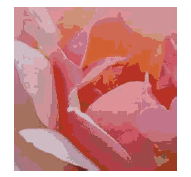

Изображение было проиндексировано с 32 цветами, а цвета выглядят блочными.
На рисунке 20.12 показано простое изображение, построенное с помощью
инструмента Blend и градиент Full saturation spectrum CW.

На рисунке 20.13 показано то же изображение
после того, как мы проиндексировали его, используя 256 различных цветов.

Хотя мы использовали максимальное количество
цветов, изображение не выглядело правильно, поэтому мы добавили
сглаживание, чтобы сгладить переходы. Но оно все еще
не выглядит правильно.

### Экспорт в GIF

Когда вы экспортируете изображение в формат GIF
(.gif), GIMP открывает диалоговое окно, показанное на рисунке
20.14.

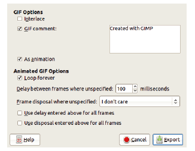

Если вы сохраняете неподвижное изображение, этот диалог позволяет
вам добавить нужный комментарий и проверить INTERLACE. INTERLACE создает изображение, которое отображается
постепенно, что может быть полезно для большого изображения, загружающегося с маленькой скоростью из Интернета.
Если изображение имеет больше одного слоя, появляется
возможность сохранить его в виде анимации.
Проверка AS ANIMATION расширяет диалоговое окно и
вы можете настроить параметры анимации
в «Форматы вывода».
Если изображение находится в режиме RGB при экспорте
его как GIF, оно автоматически преобразуется
в индексированный режим, используя стандартную цветовую карту.
Преобразование его в индексный режим (Image: Image >
Mode > Indexed) в первую очередь безопаснее; таким образом вы
может выбрать цветовой пакет и использовать ли
размытие.

## PNG

Формат Portable Network Graphics (PNG)
был впервые определен как бесплатная замена для GIF
на пике битвы над патентом алгоритма сжатия LZW, используемого в GIF. PNG
использует алгоритм сжатия без потерь, без патентов
и разработан, чтобы избежать большей части недостатков GIF, включая ограничение на индексированное
представление.
Формат PNG стал стандартом ISO в
2003 году и был пересмотрен через год. Хотя PNG
явно превосходит GIF, он не полностью заменил
его по двум причинам: отсутствие поддержки для
анимации и нежелание Microsoft внедрять
его правильно в Internet Explorer.
PNG поддерживает RGB, оттенки серого и индексированные
изображения, но он не поддерживает другие цветовые пространства, такие
как CMYK. Он также поддерживает прогрессивную прозрачность
как дополнительный канал, когда изображение
находится в режиме RGB или в оттенках серого путем добавления
Альфа-значения для палитры в индексированном режиме. Поскольку PNG использует сжатие без потерь, оно
файлы этого формата весят больше, чем JPEG-файлы, но формат
явно превосходит JPEG в случае
фотографий, на которых печатается текст. Алгоритм сжатия с потерями, используемый для JPEG, размывает контуры
символов, как показывают рисунки 20.15 и 20.16.

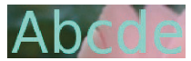

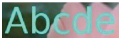

Снижение сжатия, используемое JPEG, приводит к
меньшему размеру файлов, вдобавок и качество изображения не меняется, пока коэффициент качества более 50.
По сравнению с GIF, PNG фактически генерирует
меньшие файлы, если условия одинаковы (изображение находится в индексированном режиме). 
Если вы экспортируете GB-изображение в виде PNG, оно остается в RGB
и, следовательно, занимает больше места, потому что
он содержит больше цветов. Если вы впервые конвертируете
изображение в индексный режим, а затем экспортируете его
как GIF, так и PNG, файл PNG составляет примерно половину
размер файла GIF.
Формат PNG хорошо подходит для всех видов
изображения, кроме анимаций. (Но для фотографий
без текста JPEG предпочтительнее, поскольку
размер файла меньше.) При хранении простых иллюстраций, таких
как мультфильмы, которые имеют только несколько цветов,
не забудьте преобразовать изображение в индексированное
перед экспортом.

### Экспорт в PNG

Когда вы экспортируете изображение в формате PNG (.png),
откроется диалоговое окно на рисунке 20.17.

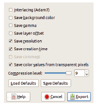

Вот наиболее полезные записи в диалоговом окне:
• INTERLACING: этот параметр создает изображение,
которое загружается постепенно.
• SAVE BACKGROUND COLOR: этот параметр предназначен для
устаревших браузеров, которые не могут обрабатывать прогрессивную
прозрачность. Используя этот параметр, вы можете
выбрать цвет, который отображается на месте
прозрачных пикселей. К сожалению,
Internet Explorer не распознает эти
настройки.
• SAVE RESOLUTION: этот параметр полезен только
если программа, открывающая изображение, может читать
сохраненное разрешение.
• SAVE CREATION TIME: этот параметр сохраняет
времени и даты, когда изображение было сохранено в последний раз.
• SAVE COMMENT: любые комментарии, добавленные через
Image: Image > Image Properties на
вкладке COMMENT сохранены.
• SAVE COLOR VALUES FROM TRANSPARENT
PIXELS: Полностью прозрачные пиксели могут
иметь значение цвета, которое будет отображаться, если позже
прозрачность уменьшается или удаляется.

# Родные форматы GIMP

Все, что вы можете сделать в GIMP, может быть представлено в 
формате XCF. Собственный формат - это файловая структура
разработанная специально для части программного обеспечения.
GIMP также имеет инструменты для определения новых кистей,
шаблоны, палитры и градиенты. Каждый из этих инструментов
также имеет собственный формат в GIMP. Вы можете скачать
пользовательские кисти, узоры, палитры и градиенты
из Интернета или даже создавать свои собственные
и отправлять их другим пользователям для загрузки.

## XCF

XCF - самый важный формат GIMP.
Когда вы сохраняете изображение в XCF, вы сохраняете
все его компоненты, слои, группы слоев, маски, каналы, пути, руководства и т. д. Единственная
вещь, которая не сохраняется - это история отмены, которая
значительно увеличила бы размер файла.
XCF - единственный формат, который гарантированно
хранит всю информацию об изображении, над которым вы
работаете в GIMP, и это лучший формат для продолжения
работы.
Поскольку XCF хранит так много информации,
файл XCF может быть довольно большим, но GIMP позволяет сжать его, 
используя один из двух внешних алгоритмов сжатия без потерь: используемый
Gzip и Bzip2. Bzip2 дает
лучшие результаты, чем Gzip, но только на 30% или
максимум на 40%. Bzip2 также намного медленнее. GIMP
может загружать и сохранять файлы, сжатые с помощью этих
алгоритмов без предварительной распаковки.
Хотя XCF можно прочитать несколькими другими
приложениями, включая ImageMagick, Krita и
Inkscape, он не представлен как универсальный формат.
Когда вы сохраняете изображение посредством Image: File >
Save As или SHIFT + CTRL + S, GIMP автоматически
предполагает, что формат файла XCF и добавляет
соответствующее расширение к имени файла.
Для всех других форматов вывода вы должны экспортировать
изображение через Image: File > Export As или
SHIFT + CTRL + E. Команды экспорта не могут
генерировать XCF. Если изображение изменено, а затем
экспортировано, GIMP не рассматривает изображение
сохраненным и открывается окно предупреждения, если вы попытаетесь
закрыть его.
