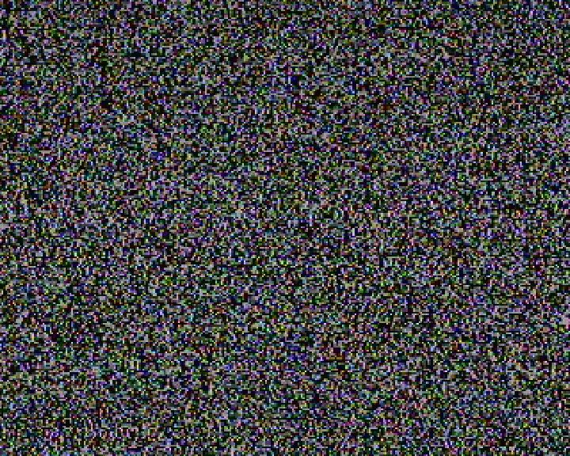
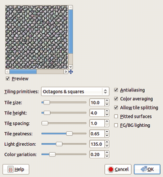
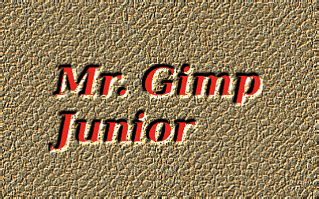
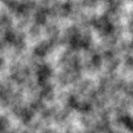
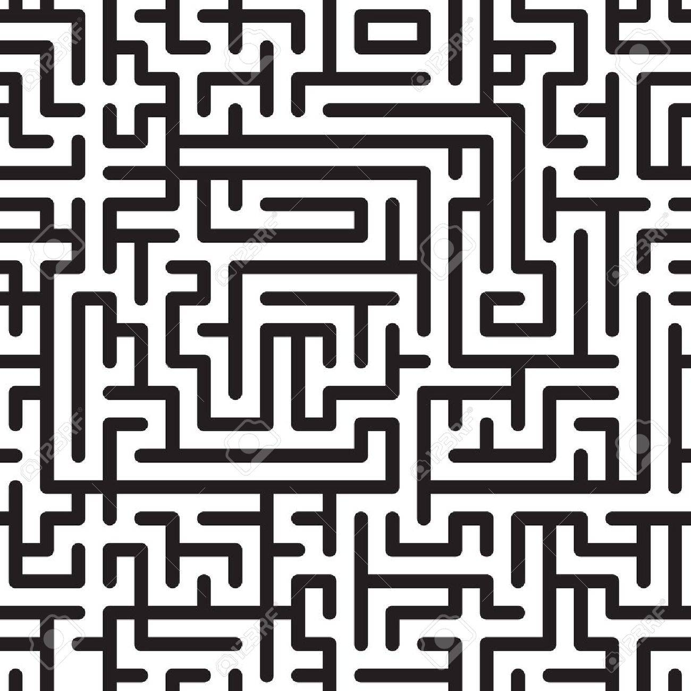

# Глава 9. Логотипы и текстуры
Логотип является важной частью любой веб-страницы,
рекламы или фирменных бланков. GIMP - отличный
инструмент для создания логотипов. Фактически, многие встроенные
плагины логотипов доступны в __Image : File >
Create > Logos__. В дополнение к логотипам мы обсудим в
этой главе текстуры, потому что текстуры являются важными
частями дизайна логотипа. Многие из методов, эффективных 
при создании и изменении дизайна логотипа, так же эффективны и для
создания текстур. Далее мы создадим текстуру, чтобы 
затем использовать её в качестве основы для логотипа.

## Создание багажной бирки

Текстура, которую мы создадим, будет имитировать
кожу. На ней будет выбит текст.Конечным продуктом 
будет багажная бирка для "Mr. Gimp Junior.
Создайте новое изображение (__Image : File > New__ или
нажмите CTRL + N). Выберите размер 400 × 250 в качестве размера
и RGB в качестве типа изображения и используйте цвет фона 
по умолчанию (то есть белый).
Заполните это изображение шумом. Выберите __Image:
Filters > Noise > Hurl__ - откроется диалоговое окно
на рис. 4.1. Выкрутите ползунок RANDOMIZATION
до 60% (можно использовать колесико мыши для этого).
Оставьте значение REPEAT равным 1.
Нажмите «ОК». Вы получите что-то вроде того, что есть на рисунке 4.2.
Теперь выберите __Image: Filters > Distorts > Mosaic__.
Выберите параметры, показанные на рисунке 4.3
(т. е. OCTAGONS & SQUARES для TILING PRIMITIVES
и 10.0 для TILE SIZE). Конечно, ваши
эксперименты с другими значениями тоже приветствуются, 
но это позже - для начала следуйте нашим инструкциям
Результат, показанный на рисунке 4.4, имеет некоторое
сходство с кожей, но мозаика слишком
резко выражена. Еще раз выберите фильтр Hurl, но на этот раз установите RANDOMIZATION на 40%. На
рисунке 4.5. мозаика более мягкая, но
цвета все еще не реалистичны.
Выберите два оттенка коричневого цвета - более темный оттенок
как цвет переднего плана и более светлый, как
цвет фона. Мы выбрали 8c6434 и
a29d89. Временно выберите инструмент Blend (L)
и убедитесь, что параметры инструмента установлены как показано
на рис. 4.6 (т. е. линейный градиент с переднего плана
на фоне без повторения).
Теперь примените Image: Colors > Map > Gradient
Map. Этот инструмент действует немедленно, без
появления отдельных диалоговых окон.Нужное значение вы уже установили
в инструменте Blend. Результат появляется
на рис. 4.7. Обратите внимание, что к "затонувшим" частям 
применяется цвет переднего плана изображения и
цвет фона применяется к выступам
Но изображение недостаточно рельефно. Лучший инструмент для
добавление неровностей - это Image: Filters > Map > Bump Map.
В диалоговом окне, показанном на рисунке 4.8,
рельеф неправильный, потому что каналы отображаются как
ямы и ямы как впадины. Так вышло,
потому что свет приходит снизу из-за
значение AZIMUTH. Этот параметр назначает
направление света: 0 - справа, 90 -
сверху,180 - с левой стороны, а 220 - снизу. 
Выберите 135, чтобы свет исходил из
левого верхнего угла. Задайте другие параметры,
как показано на рисунке. Нажмите «ОК», и вы увидите рисунок 4.9.
Следующим инструментом, который мы используем, является инструмент «Text» (T).
Его варианты отображаются на рисунке 4.10. Сделайте передний план
чёрным, и выберите жирный шрифт
и большой кегль. Мы выбрали 50 пикселей, что
хорошо работал для этого примера. После того, как вы установите параметры, выберите
верхний левый угол текстуры кожи, который вы
только что сделали. Введите Mr. Gimp Junior или своё 
собственное имя. В новом прозрачном слое над фоном появится
текст с заданными ранее параметрами. На рисунке 4.11 видны
границы нового слоя.
Теперь дублируем текстовый слой. Обратите внимание, что копия сохраняет особое
свойство - остаётся текстовым слоем. Убедитесь, что выбрана копия, затем выберите фильтр Image: Filters > Blur > Gaussian Blur.
В диалоговом окне, показанном на рисунке 4.12, выберите 5.0
для обоих радиусов. BLUR METHOD не имеет значения. Нажмите «ОК».
Теперь создайте новый слой, заполненный белым (
левая кнопка внизу диалогового окна «Слои»).
Переместите этот слой под размытый текстовый слой
(кнопка со стрелкой вниз в диалоговом окне «Слои»).
Соедините размытый текстовый слой с белым
(щелкните правой кнопкой мыши по строке размытого текстового слоя в
диалоговом окне «Layers» и выберите MERGE DOWN).
Скройте оба текстовых слоя (щелкните значки глаз рядом с их эскизами в диалоговом окне «Слои»). Выберите
фоновый слой (щелкните его миниатюру в
диалоговом окне «Layers»). Диалоговое окно «Слои» теперь должно выглядеть так, как показано на рисунке
4.13. Выберите Image: Filters > Map > Bump
Map. В меню BUMP MAP выберите
размытый текстовый слой в виде карты. WATERLEVEL
должнен быть около 80. Остальные параметры оставьте без изменений. 
Можете поизменять параметр AZIMUTH для лучшего понимания его работы. Нажмите OK, чтобы получить изображение, показанное на рисунке 4.14.
Этот результат все еще нуждается в некотором улучшении.
Выберите начальный слой текста и сделайте его видимым
(щелкните по значку глаза в его строке). Щелкните по этому слою правой кнопкой мыши
в диалоговом окне «Layers» и выберите ALPHA TO
SELECTION. Поскольку фон этого слоя
прозрачный, вы получаете отличную выборку вокруг
текста. Уменьшите эту выборку на 1 пиксель (Image:
Select > Shrink).
В диалоговом окне «Layers» скройте текстовый слой и
выберите кожаный фон. Выберите цвет переднего плана ярко-красный и заполните выделение,
используя CTRL +, . Наконец, удалите выделение
с SHIFT + CTRL + A. Вы получите окончательный результат
как показано на рисунке 4.15.
Вы можете заполнить ярлык, добавив
наклон (Image: Filters > Decor > Add Bevel), уменьшая
количество кожи вокруг этикетки,
пробивая отверстие в углу и т. д. Мы
оставим эти дополнительные действия до вас.

## Текстуры

Логотип часто требует создания текстуры в первую очередь.
Шаблоны, предоставляемые GIMP, могут использоваться в качестве текстур.
Вы можете просмотреть их в диалоговом окне
Patterns, первоначально расположенном ниже диалога «Слои».
Но у вас есть только несколько моделей на выбор, и их количество слишком невысоко. Ты можешь найти
больше шаблонов и текстур онлайн, но построение
ваших собственных не очень сложно.
В этом разделе мы расскажем вам о черепицах,
который позволяет без проблем заполнить неограниченную площадь
повторением меньшего изображения и смешением
ребра вместе. Затем мы представим короткий список
инструментов, доступных в GIMP для создания новых
текстур. Наконец, мы продемонстрируем эти инструменты, поэтому
вы сможете использовать их для быстрого создания собственных текстур

### Фильтр «Make Seamless»

У GIMP есть инструмент, который позволяет с легкостью нам создавать черепичное
изображение. Мы продемонстрируем это на простой
геометрической форме. Создайте новое изображение 400 × 400
с белым фоном. Используя инструмент Rectangle
select tool (R), выберите прямоугольник размером 250 × 200
помещенный в центр изображения. Используя Image: Select >
Border, создайте границу шириной 5 пикселей. В заключение,
заполните эту границу черным цветом и удалите
выбор (SHIFT + CTRL + A). Вы можете увидеть результат на рис. 4.16.
Эта очень простая плитка не сделала бы очень
хороший рисунок. Применяя фильтр Make Seamless
(Image: Filters > Map > Make Seamless)
(который не имеет параметров и работает сразу),
вы получите рисунок 4.17. Прямоугольник был разрезан на четыре части, которые были скопированы в
углы изображения. Градиент также был, но в этом случае его почти
не видно из-за белого фона.
Чтобы проверить результат, вызовите Изображение: Фильтры>
Карта> Маленькие плитки. Результат появляется на рисунке
4,18. Исходное изображение было уменьшено пополам и дублировано четыре раза. Эта
изображение явно плавно, а шаблон
удивительно интересно.
В предыдущем примере Make Make
фильтр был эффективным. Это не всегда так, если
исходное изображение более сложное.
правильное начальное изображение может привести к разумному
хороший рисунок, как на рисунке 4.19, но это
исключение, а не правило. Создать приятный
образ из сложного изображения, вам сначала нужно
для редактирования изображения с помощью некоторых других инструментов
доступный в GIMP

---

## 📝 Лабораторное задание

Цели выполнения лабораторного задания к __главе 9__:

- цель № 1;
Создать простейший логотип 
- цель № 2;
Создать простейшую текстуру

### 🔴 Ход выполнения

#### 1. 

создайте новое изображение через __(Image: File > New)__ или CTRL+N
выберите размер 400х250 пикселей и белый начальный цвет.
Полностью заполните изображение с помощью hurl noise.
для этого выберите __Image:(Filters > Noise > Hurl)__ что откроет специальное меню. Поставтье ползунок 'RANDOMIZATION'на 60% (или испозьзуйте колесо мыши) оставляем ползунок 'REPEAT' на стартовой отметке. Мы получим нечто подобное 

теперь выберите __Image: Filters > Distorts > Mosaic.__

установите параметры как на рисунке

теперь выберем e __Image: Colors > Map > Gradient
Map__ установим любой цвет 
теперь вводим текст (Т)(любой)
заблюрим текст с помощью  __Image: Filters > Blur > Gaussian Blur__
выбираем __Image: Filters > Map > BumpMap.__
ставим'WATERLEVEL' на 80
выдираем __Image:Select > Shrink__ 

финальный результат

Указания

1.2.

Указания

#### 2. 
для начала создадим задник.Для этого можно загрузить изображение,нарисовать свое с помощью графических инструментов или же автомотически создать его спомощью фильтров. __Image: Filters >Noise__ поможет вам создать фон из разнообразных шумов.
__Image: Filters >Render__ так же является способом создания текстур 
к примеру  __Clouds > Plasma__
позволяет создать цетовую текстуру

нажмите __Clouds > Solid Noise__
для создания монохромной текстуры

__Pattern > Checkerboard__ помогает создать шашечки

 __Pattern > Maze__ создает лабиринт

Указания

#### 3. 

3.1.

Указания
