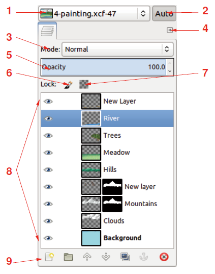
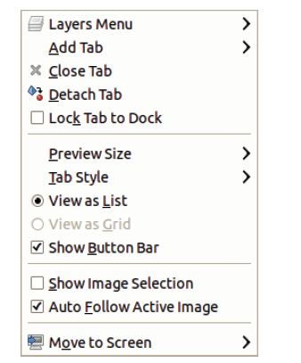
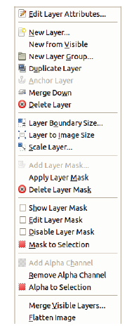
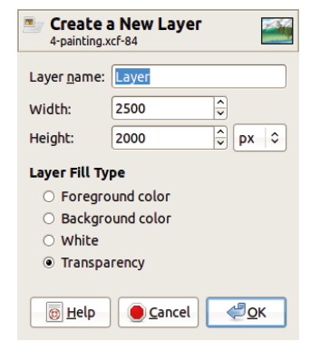
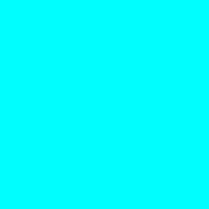
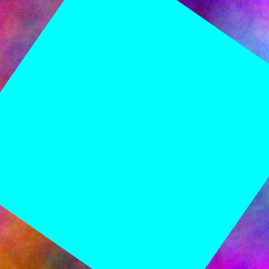
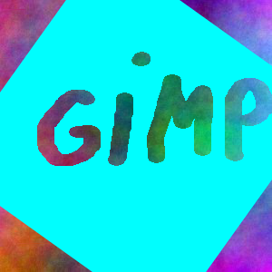

# Глава 3. Слои

Слои настолько важны для GIMP, что без них
это мощное приложение было бы почти бесполезным.
Вместо этого мы могли бы использовать GIMP только
для создания простых рисунков или незначительного
редактирования снимков. Все более мощные и универсальные
функции GIMP основываются на работе со слоями.
Когда изображение имеет несколько уровней, рабочая 
область GIMP выступает как стек прозрачных пленок.
Поэтому существующее изображение можно разбить на части,
каждая из которых будет на своем слое (пленке). Вы можете 
установить степень прозрачности слоев (видимость) и 
настроить их сочетаемость с другими слоями. 
Вы можете перемещать их вокруг рабочей области и менять их 
порядок в стеке слоев. Перед тем, как изменить слой, его 
можно продублировать, и тогда неповрежденная копия
останется (на случай, если вы допустили ошибку или хотите
использовать слой для других целей). Расслоение
позволяет добиться очень многого, однако в этой главе мы
охватим только основные понятия; в следующих 
главах эти понятия помогут нам в знакомстве с инструментами
и функциями, предоставляемыми GIMP. В этой главе 
мы рассмотрим диалог «Layers», меню «Layers»,
и меню «Image : Layer».

## Диалоговое окно «Layers»

На рисунке 11.1 показано диалоговое окно «Layers»
для картины, созданной в главе 3. Это
диалоговое окно, вероятно, является самым важным из всех
в GIMP, включая панель инструментов, поскольку
последнее можно заменить на меню Image : Tools.
Диалоговое окно «Layers» по умолчанию является 
компонентом многодиалогового окна. Если вы случайно 
закрыли его, вы можете воспользоваться
Image : Windows > Docable Dialogs > Layers или комбинацией 
клавиш CTRL + L, чтобы открыть его снова. Комбинация клавиш 
вызывает диалог на передний план даже если он был скрыт
командой TAB.

### Компоненты диалогового окна «Layers»

Давайте рассмотрим компоненты диалогового окна «Layers».
Цифры ниже относятся к рис. 11.1.

1. Название изображения на самом деле является компонентом не
диалога, а скорее многодиалогового
окна. Если вы выберете другую вкладку (Channels, например),
название изображения останется видимым. Вы можете настроить параметр,
согласно которому название изображения будет отображаться 
в меню «Configutarion» (открывается кнопкой под номером 4). 
Чтобы показать название изображения, отметьте галочкой
SHOW IMAGE SELECTION. Его отображение очень полезно,
когда вы работаете с несколькими изображениями одновременно.
2. Эта кнопка переключает режим мультидиалога
и режим отображения текущего изображения.
3. В раскрывающемся меню MODE устанавливается режим 
смешения текущего слоя.
4. Эта кнопка вызывает меню «Configutarion» (рисунок 11.2).Первая строка -
меню «Layers», которое будет обсуждаться позже
в этой главе. Меню «Configutarion» также
позволяет добавлять, закрывать или отделять вкладки от
многодиалогового меню, изменять размер и стиль 
вкладки и показывать или скрывать элементы
в диалоговом окне. Последний пункт позволяет перемещаться 
между несколькими дисплеями, если
вы используете больше одного.

5. Ползунок «Opacity» позволяет установить непрозрачность
текущего слоя. Прозрачность слоя
сочетается с режимом наложения слоев для
определения степени взаимодействия между пикселями
текущего слоя и лежащих под ним. Например, режим Dissolve
отличается от нормального только если непрозрачность
слоя составляет менее 100%.
6. Значок кисти - это кнопка переключения. Нажав на неё, 
вы заблокируете пиксели слоя, что полезно,
если вы хотите защитить слой от случайного
изменения.
7. Значок квадрата, другая кнопка переключения, блокирует
альфа-канал слоя, если он есть. Если
альфа-канал заблокирован, инструменты рисования
не работают в прозрачных областях текущего
но они работают в непрозрачных областях, пока пиксели 
этого слоя разблокированы. Если обе кнопки переключены (пиксели и альфа-канал),
слой не может быть изменен вообще. Эти кнопки
полезны, например, при создании логотипов. Если вы хотите размыть
логотип, чтобы добавить к нему рельеф, альфа-канал
должны быть разблокированы. Если вы хотите нарисовать
логотип, альфа-канал должен быть заблокирован.
8. Основная часть диалога «Layers» содержит столько записей, 
столько на изображении есть слоёв.
Текущий уровень отмечен акцентом на
соответствующей записи (синяя на рисунке 11.1,
где текущий слой называется River).
Всегда помните, какой слой является текущим,
потому что все, что вы делаете с изображением, будет
применяется к этому слою, который может быть невидим или
скрыт другим слоем. Когда текущий
слой скрыт, вы не сможете увидеть эффекта от своих действий на нём.
Однако все изменения всё-таки происходят, если, конечно, 
активен хотя бы один слой.
9. В нижней части диалогового окна «Layers» отображается
ряд из семи кнопок, которые являются ярлыками для
записи в слоях или меню Image : Layers.
Эти кнопки позволяют сделать следующее (слева направо):
 •  Создать новый слой. Удерживайте нажатой клавишу SHIFT
чтобы создать слой, используя предыдущие параметры. 
В противном случае откроется диалоговое окно для их настройки
 •  Создать новую группу слоев.
 •  Поднять текущий слой в стеке слоев.
Зажмите SHIFT, чтобы переместить его вверх.
 •  Опустить текущий слой в стеке слоев.
Зажмите SHIFT, чтобы переместить его в нижнюю часть.
 •  Дублировать текущий слой.
 •  Закрепить плавающий слой.
 •  Удалить текущий слой.

### Вкладка «Layer» в диалоговом окне «Layers»

На рисунке 11.3 показаны все возможные компоненты
слоя, отображаемого в диалоговом окне «Layers» (слева направо) :

• Значок глаза обозначает тот факт, что слой
видимый (если ни один верхний слой не скрывает его). Нажав на него, 
можно скрыть слой. Невидимый слой не
воздействует на видимое изображение, но сокрытие 
слоя не препятствует его изменению.
• Значок ссылки обозначает тот факт, что слой с чем-то связан.
Это имеет смысл только тогда, когда он активирован для нескольких объектов.
Через ссылки мы можем связать вместе несколько слоев или 
каналов и путей, используя их соответствующие
диалоговые окна. Когда несколько объектов связаны, 
инструмент «Move» и инструменты преобразования работают в целом
как набор связанных объектов. Однако каждое изображение
ограничивается только одним набором связанных объектов.
Щелчок по цепочке включает или выключает ссылку на
этот слой.
• Эскиз обеспечивает миниатюрный вид
содержимого слоя. Если кадр эскиза белый, то этот
слой является текущим и любая модификация
повлияет на него. В противном случае - рамка
чёрная. Нажатие на миниатюру делает
слой активным. Щёлкните по нему и удерживайте кнопку мыши,
чтобы всплыла миниатюра. Нажатие и перетаскивание
миниатюры на панель инструментов повлечёт за собой создание нового
изображение из слоя. Перетаскивание его в другое
изображение копирует слой как новый в
это изображение.
• Если слой имеет маску, то
её миниатюра отображается справа и имеет
те же свойства, что и миниатюра слоя.
Если рамка маски белая - маска активна,
и любые сделанные изменения будут
применяется к ней. Если рамка маски
красная - маска слоя неактивна. Когда
маска слоя выбрана, пунктирный контур в
окне изображения меняется с чёрно-жёлтого
на чёрно-зелёный. CTRL-щелчок по 
миниатюре ведёт к активации маски слоя,
ALT-щелчок переключает её видимость.
Перетащите миниатюру маски слоя в другое изображение,
чтобы добавить её в качестве слоя, или на панель
инструментов для создания её копии в качестве нового изображения.
• Конечным элементом в записи слоя является имя слоя.
Оно отображается жирным шрифтом, если слой
не имеет альфа-канала. Имя
назначается слою при создании,
но его можно изменить. Дважды щелкните по нему, нажмите
F2 или выберите Layers : (щелкните правой кнопкой мыши) >
Edit Layer Attributes для его изменения.
Если слой предназначен для анимации, его имя может
содержать текст, который отражает свойства анимации:
продолжительность в миллисекундах (200 мс, к примеру)
и режим кадра (combine) или (replace).

### Ярлыки клавиш в диалоговом окне «Layers»

Некоторые удобные сочетания клавиш доступны,
когда диалог «Слои» активен :
• Клавиша со стрелкой вверх выбирает слой над
текущим как новый текущий слой;
стрелка вниз выбирает слой ниже.
• Клавиша HOME выбирает верхний слой из стека,
а клавиша END - нижний.
• Горизонтальные клавиши со стрелками позволяют переключаться между
четырьмя (или пятью) компонентами текущего слоя:
видимостью, привязкой, эскизом(миниатюрой) слоя, эскизом маски слоя и именем слоя.
• Клавиши SPACE и ENTER переключают выбранный компонент слоя
(видимость, привязка, активность слоя или его маски
и имя слоя), даже если его слой не активен.
• Нажатие CTRL вместе с верхней или нижней
стрелкой позволяет совершить переход из слоя в слой без
изменение текущего слоя. Вы можете использовать это
в сочетании с горизонтальными клавишами со стрелками
или клавиши SPACE или ENTER.
• Кнопка DELETE стирает содержимое
текущего слоя (или выбранного на этом слое).

### Использование диалогового окна «Layers»

Таким образом, диалоговое окно «Layers» позволяет вам делать
следующее : 
• Открывать меню конфигурации, нажав
верхнюю правую кнопку. Первая запись в этом меню
открывает меню «Layers» (далее в этой главе).
• Изменять режим наложения слоя. 
• Устанавливать непрозрачность слоя.
• Блокировать пиксели или альфа-канал.
• Менять видимость слоя, щелкнув значок глаза.
Обратите внимание, что невидимый слой все еще может
быть изменен.
• Устанавливать активность слоя, щелкнув по его
эскизу. Обратите внимание, что это не меняет
видимость.
• Задавать действие маске слоя, нажав 
CTRL-щелчок или ALT-щелчок по миниатюре
изобрадения.
• Изменять имя слоя двойным щелчком по
его имени.
• Перемещать слой в стек слоев, нажав на его миниатюру
и перетаскивая её или нажав на его имя и перетаскивая
слой вверх или вниз по стеку слоев. Этот метод также может быть
использован для перемещения слоя в группу слоев или из неё.
• Открывать меню «Layers», щелкнув правой кнопкой мыши в любом месте
в записи слоя.
• Использовать семь кнопок в нижнем ряду для
выполнения общих задач, связанных с уровнем.

## Меню «Layers»

Меню «Layers» (рисунок 11.4) выбирается
щелчком правой кнопке мыши по любому пункту в 
диалоговом окне «Layers».

Если текущий слой - текстовый, это меню содержит пять
дополнительных пунктов. В этом разделе мы рассмотрим каждый из пунктов в
меню «Layers».
EDIT LAYER ATTRIBUTES открывает диалоговое окно,
показанное на рисунке 11.5. Единственный атрибут, который
может быть изменен - это имя слоя.

NEW LAYER открывает диалоговое окно, показанное на рисунке
11.6. Название слоя может помочь
вам быстро определить различные компоненты
изображения. Если вы его не вводите, по умолчанию берется название Layer # 1.
Ширина и высота первоначально такие же, как у 
холста, но вы можете вводить разные значения.
Если новый слой больше холста,
области слоя, которые выходят за пределы рабочей области не будут видны. Размеры нового слоя
могут быть заданы в процентах от
размера холста, в пикселях или в ряде
других единиц. Обратите внимание, что измерения в дюймах,
миллиметрах или других стандартных единицах измерения
рассчитываются с учетом текущих. Наконец, четыре
переключателя позволяют вам выбирать, что изначально будет на слое. 
Можно поменять цвет фона, задать параметр прозрачности. Если не будет выбрана прозрачность,
новый слой не будет иметь альфа-канала.
NEW FROM VISIBLE создает новый слой, изначально
называющийся Visible, заполненный изображением. Этот новый слой помещается в
стек чуть выше текущего слоя. Слои, стоящие перед ним, сглаживаются
таким образом, что видно только один новый слой
даже если остальные не скрыты.
NEW LAYER GROUP создает новую пустую группу слоев,
по умолчанию носящую название Layer Group. Группы слоев упоминались в разделе 11.3.
DUPLICATE LAYER делает копию текущего
слоя (или группы слоев), помещает его в стек чуть выше текущего слоя и называет его
так же, как и текущий слой плюс слово "copy". Копия наследует все характеристики
оригинала, включая его режим смешивания,
непрозрачность и блокировки.
ANCHOR LAYER активен только тогда, когда есть
плавающий выбор. См. Раздел 13.4. Плавающий
выбор привязан к последнему текущему слою.
MERGE DOWN объединяет текущий слой с
слой ниже. Если текущий слой невидим,
сливается, как будто это видно. Однако, если слой
ниже невидимо, и нет видимого слоя ниже
что MERGE DOWN неактивен. СЛИТЬ
также неактивна, когда слои ниже текущего
слой образуют группу слоев.
В меню появляется MERGE LAYER GROUP
только если текущий слой является группой слоев. Эта
группа заменяется одним слоем, состоящим из
всех слоев группы.
DELETE LAYER удаляет активный слой или слой
группа. Как и другие операции меню Layers,
это можно отменить.
Следующие четыре группы записей в слоях
меню также находятся в меню Image: Layer,
и они обсуждаются в Разделе 11.4. Следовательно
мы пропускаем последние две записи в слоях
меню.
MERGE VISIBLE LAYERS действует только на слоях
с отмеченным значком глаза, и он объединяет их
в соответствии с их непрозрачностью и смешиванием
Режим. Диалог показан на рисунке 11.7.
Новый слой можно настроить так, чтобы он соответствовал самому большому
слой, холст или нижний слой. Если DISCARD
Невидимый ящик установлен, невидимый
слои удаляются. В противном случае они остаются в
изображение. Обратите внимание, что эта операция удаляет
видимые слои из изображения, в отличие от NEW FROM
ВИДИМОСТЬ, которая, как правило, является лучшим выбором. Если
вы предпочитаете использовать ВИДИМОЙ СЛОЙ MERGE, мы
настоятельно рекомендуем сохранить копию изображения
сначала с изображением: Файл> Сохранить копию.
FLATTEN IMAGE заменяет все слои на
однослойное представление изображения. Это
деструктивная операция и должна использоваться только
после сохранения копии изображения с помощью
слои нетронутыми.
 

## Группы слоев

Группы слоев являются новой функцией в GIMP 2.8 и
концепция все еще развивается.
Чтобы создать новую группу слоев, щелкните соответствующую
в нижней части диалогового окна «Слои»
или используйте Image: Layer> New Layer Group или
Слои: щелкните правой кнопкой мыши> Новая группа слоев.
Группа слоев отображается чуть выше текущей
слой и изначально пуст. Хорошая идея
чтобы сразу дать ему содержательное имя. к
добавьте слой в группу, щелкните и перетащите его в
группы в стеке слоев. Сделайте то же самое, чтобы двигаться
слой из его текущей группы или для перемещения
целая группа слоев в стеке. Ты можешь
также добавьте новый слой в группу слоев, используя
соответствующую кнопку в диалоговом окне «Слои» или
в меню «Слои». Нажмите маленький треугольник
показать (рисунок 11.8) или скрыть (рисунок 11.9)
содержимое группы. Группа слоев может быть
помещается в другую группу слоев.
Группа слоев является полезным способом организации
слоев в сложном изображении. Следующие операции
может выполняться в группе слоев:
• Блокировка пикселей
• Изменение непрозрачности группы
• Переключение видимости с помощью значка глаза
• Переключение слоев с помощью значка цепи
• Перемещение группы в стек стека
• Перемещение слоев с помощью инструмента «Перемещение»
• Применение преобразования ко всем слоям (см.
Глава 16)
• Дублирование группы слоев и ее содержимого
• Копирование группы слоев и ее содержимого в
другое изображение, щелкнув и перетащив его, или
путем копирования и вставки
• Удаление группы слоев и ее содержимого
• Применение режима наложения слоя к слою
группы, которая воздействует только на слои
группа слоев
Мы будем использовать результат учебника из главы
3, чтобы продемонстрировать свойства слоя
группа. Этот образ имеет 20 слоев, которые мы организовали
как мы построили изображение. Каждый из четырех
колпачки грибов состоят из двух слоев, один
из которых содержит маску слоя. Грибной
стебли состоят из шести слоев. Цветок
и камень на переднем плане состоят из
четыре слоя. Наконец, есть белый фон
для всего изображения и другого слоя на
вершина стека, названная Background, которая находится в
многократный режим смешивания и содержит оригинал
Рисунок. Эти слои могут быть организованы интуитивно
в три группы слоев: грибковые стебли,
Грибные колпачки и Передний план. Сделать это без
изменение порядка слоев в стеке, нажмите
кнопка «Новый слой», когда самая верхняя
слой будущей группы активен, а затем
перемещение слоев в группу путем нажатия и перетаскивания
их на верхний слой или на пустой
Рисунок 11.10. Перемещение группы слоев шапки грибов
Рисунок 11.11. Уменьшение непрозрачности группы слоев до 50%
слой. На рисунке 11.9 показан результат, когда
эти три группы слоев сведены к минимуму.
Вы можете скрыть группу слоев, щелкнув ее глазом
значок, или вы можете перемещать все его слои одновременно
используя инструмент «Переместить» (см. рис. 11.10). Если
группа слоев скрыта, слои, которые она содержит,
невидимыми, и их глазные значки поглажены. Вы
также может изменять непрозрачность всего слоя
группа
Все слои в группе слоев должны быть смежными
в стеке слоев. Это не относится к
связывающие слои. Например, давайте объединимся
второй слой всех шапок грибов, один
содержащую маску слоя и используемую для рисования
пятен на крышках (см. рисунок 11.12). Теперь мы
могут перемещать связанные слои вместе, но отдельно
из группы, как показано на рисунке 11.13
(сравните с рисунком 11.10). Связанные слои
могут быть даже в разных группах слоев.
Группы слоев сохраняются в файле XCF, независимо
из отдельных слоев. В
GIMP 2.8, можно повернуть или масштабировать слой
группа без вращения или масштабирования
слоистых компонентов группы. Когда слой
группа вращается или масштабируется, плавающий выбор
создается с результатом преобразования,
и группа начального уровня заменяется на
объединенные, преобразованные компоненты. Человек
слои, однако, не изменяются.
 
## Меню изображения: Layer
Меню Image: Layer показано на рисунке 11.14.
Некоторые из записей также находятся в слоях:
щелкните правой кнопкой мыши меню «Слои», но есть много
новые записи.
Первые восемь записей (или семь, если нет
существующая группа слоев) также можно найти в
Слои: щелкните правой кнопкой мыши> меню «Слои», но в
Изображение: меню уровня три из этих записей
в сочетании с быстрыми клавишами:
• SHIFT + CTRL + N открывает диалог нового слоя.
• SHIFT + CTRL + D дублирует текущий слой.
• CTRL + H привязывает плавающий выбор.
Это меню и эти ярлыки позволяют нам
внести существенные изменения в стек стека без
глядя на него, что обычно нецелесообразно. Это
гораздо легче совершить ошибку, если вы не можете
посмотрите, что вы делаете. Лучше настроить слои
в диалоговом окне «Слои», когда это возможно.
Если текущий слой является текстовым слоем, слой
меню также будет содержать четыре текстовые записи,
описанных в Разделе 15.8. После этого четыре
меню обсуждалось далее.
### Меню стека
Меню Stack показано на рисунке 11.15.
В нем четыре команды, которые больше всего
полезно при работе с изображением, которое имеет много
слоев:
• SELECT ПРЕДЫДУЩИЙ СЛОЙ (PAGE UP) эквивалентен
щелкнув на предыдущем слое в
Диалоговое окно «Слои», за одним исключением: если текущий
слой находится внутри группы слоев, эта команда
не распространяется на слои за пределами
группа.
• SELECT NEXT LAYER (PAGE DOWN) выбирает
следующего слоя, с тем же исключением, что и выше.
• SELECT TOP LAYER (HOME) выбирает верхний
слой в стеке или самый верхний слой в
группа.
• SELECT BOTTOM LAYER (КОНЕЦ) выбирает нижнюю
слой в стеке или нижний слой в
группа.Обратите внимание, что клавиши со стрелками на клавиатуре
может использоваться для выбора предыдущего или следующего слоя,
но только при активном диалоговом окне «Слои». Видеть
«Ярлыки клавиш в диалоговом окне« Слои »на
стр. 234 для других доступных сочетаний клавиш
в этом диалоговом окне.
Следующие четыре команды перемещают текущий
слоя в стеке слоев:
• RAISE LAYER перемещает слой вверх в стеке.
Он не может поднять слой за пределами его текущего
группа. Чтобы переместить слой из своей группы, нажмите
и перетащить его.
• LOWER LAYER перемещает слой вниз в
стек.
• LAYER TO TOP перемещает текущий слой на
вершине стека или его группы, если она принадлежит
группу слоев.
• LAYER TO BOTTOM перемещает слой вниз
стека или группы.
Наконец, можно вызвать ЗАВЕРШЕНИЕ ЗАВЕРШЕНИЯ СЛОЯ
только из этого меню. Группа слоев рассчитывается как
один слой, и нет никаких действий для
слоя в группе слоев.
### Меню «Маска», «Прозрачность» и «Трансформирование»
В меню «Маска» рассматриваются маски слоя и обсуждается
в разделе 14.2. Он предлагает несколько больше опций
чем в слоях: щелкните правой кнопкой мыши>
Меню слоев.
Меню «Прозрачность» обсуждается в
«Прозрачность и альфа-канал» на
страница 324. Также отображаются только три ее записи
в меню «Слои»: щелкните правой кнопкой мыши> «Слои».
Использование меню «Трансформация» - самый простой способ
для переключения или поворота текущего слоя. Вы также можете
используйте инструмент Flip (SHIFT + F) или произвольное вращение,
который также доступен через Rotate
инструмент (SHIFT + R). См. «Преобразование слоя» на
стр. 375 для получения дополнительной информации о Transform
меню.

### Заключительные пять записей
Остальные пять записей в слое Image: Layer
меню обеспечивают единственный доступ к их соответствующим
операции:
• LAYER GRUNDARY SIZE открывает диалоговое окно
на рис. 11.16, что очень похоже на
диалогового окна Изображение: Изображение> Размер холста, описано
в разделе «Изменение размера изображения» на стр. 371.
Вы можете выбрать точные размеры
слой и положение его содержимого внутри
новые размеры. Отрегулируйте положение
устанавливая поля X и Y, перетаскивая
предварительного просмотра слоя в его окне или с помощью
CENTER. Если вы уменьшите размер
слой, обрезанное содержимое удаляется, но если
вы увеличиваете слой за границей
изображение, содержимое за пределами изображения
граница сохраняется, хотя и невидима. Эта
инструмент также работает с группой слоев.
• LAYER TO IMAGE SIZE устанавливает слой в изображение
размер, без диалога и без перемещения
содержимое слоя. Любая часть слоя, которая
за пределы холста удаляется. Этот инструмент
также работает со слоями.
• SCALE LAYER открывает диалоговое окно, показанное на рисунке
11.17, что совпадает с изображением:
Изображение> Диалоговое окно «Масштаб изображения», описанное в
Раздел 10.1 и «Изменение размера изображения» на
Страница 371. Разница только в том, что вы
не может изменить разрешение слоя, которое
фиксированное разрешением изображения. Этот инструмент также
работает со слоями.
• CROP TO SELECTION активен, только если есть
текущий выбор. Размеры слоя
установите на самый маленький прямоугольник, который включает
выбор.
• AUTOCROP LAYER обрезает слой до самого маленького
прямоугольник, содержащий данные цвета
отличается от границы слоя. Это
аналогично Image: Image> Autocrop Image,
описанный в разделе «Обрезка изображения» на
Страница 374. Этот инструмент также работает со слоем
групп, как показано на рисунке 11.18,
где текущий слой представляет собой весь гриб
группы слоев.

---

## 📝 Лабораторное задание

Цели выполнения лабораторного задания к __главе 3__:

- цель № 1;
Научиться использовать слои и маску слоя

### 🔴 Ход выполнения

#### 1. 

Как базу можно взять любое изображение (или создать и нарисовать свое).

К примеру :

2. Создаем новый слой через __Layer > New Layer__.
Окрашиваем его в любой цвет.

Создаем маску слоя белого цвета - полностью непрозрачную.

Слой можно повернуть через панель инструментов.

Теперь при попытке рисования на текущем верхнем слое будет виден основной нижний слой.

