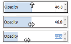
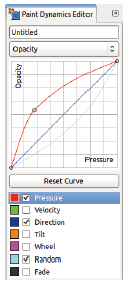
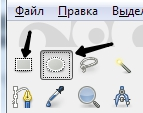

# Глава 5. Инструменты рисования

Рисование - это искусство, и поэтому многие люди
думают, что они должны родиться с талантом
хорошо рисовать. Хотя рисунок легче
для некоторых людей, с практикой, каждый может
научиться рисовать и развивать уникальный стиль

# Цифровое искусство

Вы можете думать, что цифровое искусство проще, чем традиционное
потому что компьютер рисует для вас,
но на самом деле цифровое искусство требует практики, равно как и
традиционное искусство. Если вы уже практикуете
эскиз и живопись, вы получите цифровое искусство
легче, чем если бы вы никогда не касались
карандаш.
Цифровое искусство допускает некоторые трюки и
ярлыки, которые были бы невозможны с традиционными
СМИ. Undo является одним из самых мощных
инструменты цифрового искусства выходят на сцену. Если вы
рисовать и ошибаться, вы можете попытаться скрыть
ошибка, или вы можете попытаться воспользоваться
это, что может привести к неожиданным результатам. Если
картина цифровая, однако вы можете просто отменить
ошибка и повторите попытку, что удобно
но убирает вызов и возможность
работы с ошибками.
Еще один ценный инструмент, присущий цифровым
искусство представляет собой наложенные слои. Вы можете хранить
каждый элемент картины как новый слой, и
вы можете одним щелчком скрыть слои или заблокировать их.
Одним из основных преимуществ инструментов цифрового искусства является то, что они
может ускорить утомительные процессы, такие как заполнение
область с цветом, рисунком или градиентом. Но недостатки
(например, видя бумажное зерно через
акварель или видимые мазки кисти в масле
живопись) может улучшить красоту произведения
Изобразительное искусство. Фактически, многие цифровые инструменты предназначены для
имитируют эти традиционные недостатки.
Чтобы увидеть примеры того, какое цифровое искусство может быть
используется для создания, ознакомьтесь с http://www.cgsociety.org/
и http://mattepainting.org/.
Чем больше вы тренируетесь, тем лучше вы будете
рисунок, и чем больше вы используете GIMP, тем лучше
вы будете использовать его инструменты. Даже если вы заинтересованы
в создании цифрового искусства,
вокруг маленькой эскизной панели и карандаша, чтобы вы могли
практический рисунок, когда у вас есть свободный момент
в течение дня. И не следует сдерживать, если
первоначальные зарисовки грубые - если вы продолжаете практиковать,
ваши эскизы (и ваше цифровое искусство) улучшится

## Обзор инструментов рисования

В то время как инструменты кисти изменяют пиксели вдоль
кисть, инструменты для наполнения влияют на целое изображение или
выбор:
• Заполнение ковша заполняет область сплошным цветом или
шаблон.
• Blend заполняет область градиентом.
Другими инструментами рисования являются инструменты кисти. Oни
изменить изображение с помощью мазков вручную, используя
текущую кисть или вдоль выделения или пути.
Инструменты кисти делятся на три категории:
инструменты для рисования, инструменты клонирования и модификацию
инструменты. Мы подробно обсудим эти категории
после обсуждения свойств, общих для всех
инструменты рисования

Инструменты для рисования добавляют (или удаляют) штрихи цвета:
• Карандаш создает резкий штрих.
• Кисть создает мягкий обводной ход.
• Ластик удаляет цвета вдоль хода.
• Аэрограф создает мягкий ход.
• Чернила создают сплошной, но сглаженный штрих.
Инструменты клонирования копируют что-то и делают это в
мазки:
• Клонирование копий с изображения или рисунка.
• Исцелять копии с изображения и смешивать с
окружение.
• Перспективный клон копирует изображение и отображает
вдоль перспективных линий.
Изменение инструментов трансформирует пиксели вдоль кисти
штрихи:
• Convolve размывает или заостряет пиксели.
• Smudge смазывает пиксели.
• Dodge / Burn осветляет или затемняет пиксели.
Мы также рассмотрим инструмент «Текст», «Выбор цвета»
инструмент и инструмент измерения в этой главе. Даже
хотя они не строго рисуют инструменты, они
очень полезны для создания оригинального искусства.

## Общие функции

В этом разделе мы описываем особенности и
характеристики, общие для всех или большинства
инструментов рисования.

### Параметры инструмента рисования

Все инструменты рисования имеют параметры, которые обычно
отображается в прикрепляемом диалоговом окне, прикрепленном к
Ящик для инструментов. Если вы закроете диалоговое окно параметров по ошибке,
вы можете повторно открыть его, выбрав «Изображение: Windows>
> Dockable dialogs> Опции инструмента или
дважды щелкнув значок инструмента в панели инструментов. нет
два инструмента рисования имеют точно такой же набор
, но большинство вариантов разделяют
количество инструментов. В этом разделе мы рассмотрим все
варианты, которые являются общими для по крайней мере двух чертежей
инструменты.
На рисунке 5.1 показаны все варианты для Paintbrush
инструмент, который имеет самый большой набор опций.

Щелкните значок маленького треугольника в правом верхнем углу
диалогового окна, чтобы открыть меню, показанное на рисунке
5.2. 

Это меню аналогично для всех присоединяемых
диалоги, но некоторые из них имеют дополнительные записи.
На рисунке также показаны варианты, доступные в
меню параметров инструмента.
Ниже значка треугольника называется имя инструмента
(Кисть в этом случае), а ниже -
следующие параметры:

• MODE - это выбор из 23 режимов смешивания
• OPACITY изменяет прозрачность. Прозрачность
процент сочетается с смешиванием
чтобы определить точный эффект инструмента.
Непрозрачность также зависит от динамики краски.

Ползунки были обновлены с помощью некоторых интересных
новые возможности в версии 2.8. Если
указатель мыши находится в верхней половине
слайдер, его значок имеет форму вертикали
стрелка, как показано на рисунке 5.3 (вверху).

Нажмите любая часть ползунка, чтобы получить приблизительное приближение
коэффициента непрозрачности.
Если указатель мыши находится в
нижней половине ползунка, его значок
форма двойной горизонтальной стрелки, как показано
на рисунке 5.3 (средний). Нажать и перетащить
по горизонтали, чтобы изменить коэффициент непрозрачности с помощью
более высокая точность.
Вы можете использовать колесико мыши для изменения
коэффициент с шагом в один процент
или вы можете использовать маленькие стрелки на
право делать то же самое.
Вы также можете ввести значение непосредственно в
числовое поле справа. Нажмите вверху
половина слайдера помещает курсор только спереди
числового поля. Вы можете удалить значение
нажатием клавиши DELETE или добавлением цифр в
перед значением. Нажатие нижней половины
ползунок выбирает целое числовое поле, так как
показанном на рисунке 5.3 (внизу), а затем вы
может ввести новое значение.
Существуют два удобных сочетания клавиш: <
уменьшает непрозрачность и увеличивает ее.
шаг всегда 1, но вы можете сохранить ключ
нажата для уменьшения или увеличения. таким образом
вы можете изменить непрозрачность одной рукой
и рисовать другим.
ЩЕТКА меняет тип кисти. Этот вариант,
а также следующие шесть, присутствует только для
инструменты кисти. Щелкните значок кисти, чтобы увидеть
сетку всех доступных кистей. Вы также можете
введите имя кисти в поле справа.
Как только вы начнете печатать, кисти соответствуют
то, что вы набрали, появляется ниже.
Каждое физическое устройство имеет свои собственные независимые
настройки, поэтому, если вы выберете кисть для
стилуса, это не повлияет на то, какая кисть используется с
мышь или ластик. Напротив,
если вы прикрепляете специальную кисть к стилусу, это
остается неизменным, использует ли стилу
Инструмент Paintbrush, инструмент Smudge или любой другой
зубная щетка. Вы также можете связать
кисть с каждым из этих инструментов путем изменения
в диалоговом окне «Изображение: Редактировать»> «Настройки».
• SIZE изменяет размер кисти, и хотя
диапазон [1 - 1000], если вы перемещаетесь
курсор далеко вправо от ползунка, вы
может выбрать любой размер. Эта опция также затронута
текущей динамикой Paint Dynamics.
изогнутая стрелка справа сбрасывает размер
по умолчанию для текущей кисти.
колесо мыши меняет его с шагом в один
соток.
Два сочетания клавиш удобны для
изменение размера кисти: [уменьшается
он, и] увеличивает его. Как и с непрозрачностью
изменения, шаг всегда равен 1, и вы можете
удерживайте нажатой клавишу.
• ASPECT RATIO изменяет пропорции
кисть в диапазоне от -20 до +20. Этот параметр
является новым в GIMP 2.8. Если значение положительное,
кисть растягивается вертикально, и если она отрицательная,
щетка растягивается горизонтально. Покрасить
Динамика может управлять этой опцией.
• ANGLE вращает кисть, поэтому она не действует
если кисть отлично круглая. Опять же, Paint
Динамика может управлять этой опцией.
ДИНАМИКА - это место, где вы можете изменить текущий
динамика краски . Нажатие кнопки
открывает меню, показанное на рисунке 5.4, для
выбирая конкретную динамику. 

Дно кнопки позволяют получать более мелкие или большие предварительные просмотры,
для отображения их в виде списка или как сетки и
для открытия диалога Paint Dynamics. Ты можешь
также начните печатать в поле справа, и
GIMP завершает имя. Кнопка на
справа открывается редактор Paint Dynamics.
• Если вы нажмете маленький треугольник слева от
DYNAMICS OPTIONS, меню расширяется и
вы увидите следующие варианты:
- FADE LENGTH влияет на параметры
изменение по длине хода. Любой параметр
может быть настроено на увядание, а кисть
затухает или выгибается вдоль длины затухания. когда
REPEAT установлен на NONE, останов хода
после достижения длины затухания.
Когда он установлен в SAWTOOTH WAVE или TRIANGULAR
WAVE, эффект повторяется в различных
узоры. Если проверяется REVERSE, способ
кисть меняется, когда вы рисуете, меняет направление.
Эта опция также может быть назначена указателю
движение через динамику краски.
- COLOR OPTIONS не использует передний план
цвет для окраски; он получает свои цвета
от указанного градиента. Это правда
даже в случае цветной кисти. Но это
опция зависит от текущей динамики краски,
поэтому эффект зависит, по крайней мере, от
один флажок проверяется в строке «Цвет»
Матрица отображения текущей краски
динамика.
 APPLY JITTER вызывает колебания хода кисти со стороны
на сторону в диапазоне от [0 до 50]. Если поле отсутствует
проверяется в строке Jitter текущей краски
динамика, дрожание обратно пропорционально
давлению. Если проверено хотя бы одно поле
в линии Джиттера текущей динамики краски,
описанное поведение подавляется.
• SMOOTH STROKE делает удар более однородным
используя две настройки. КАЧЕСТВО [1 -
100] определяет равномерность хода. ВЕС
[3 до 1000] ограничивает минимум хода
диаметр.
Обратите внимание, что последние два параметра относятся ко всем
инструменты рисования.
Другое поведение, которое разделяет все инструменты кисти
эффект нажатия и удержания SHIFT и
CTRL:
• Если вы нажимаете SHIFT при использовании кисти,
вы можете нарисовать прямую линию.
• Если вы нажимаете CTRL при использовании карандаша,
Инструменты для кисти, ластика или аэрографа
указатель становится пипеткой, а следующий
цвет, который вы нажимаете, становится цветом переднего плана
(или фона для Eraser).
• Если вы нажмете SHIFT, а затем CTRL,
прямая линия ограничена ближайшей
15◦, что полезно при параллельном рисовании
или перпендикулярных линий.

### Динамика краски

Каждый инструмент кисти использует общую функцию, называемую
динамика краски, что особенно полезно, если вы
есть графический планшет. С динамикой краски,
вы можете изменить параметры кисти
инструмент, основанный на том, как вы перемещаете мышь или
планшетный стилус. Это часть GIMP, которая была
значительно улучшилось в версии 2.8. Семь указателей движения
характеристики могут быть обнаружены, хотя
некоторые из них работают только с планшетом
и специализированный стилус:
• ДАВЛЕНИЕ - это величина силы, применяемая, когда
окрашивание штриха и его можно контролировать только
с помощью стилуса и планшета.
• VELOCITY - это относительная скорость, с которой вы
переместите указатель.
• НАПРАВЛЕНИЕ - направление движения.
• TILT - это угол стилуса. Вы можете использовать
эта динамика только с планшетом, и даже некоторые
таблетки не могут обнаружить наклон.
• КОЛЕСА управляет вращением колеса, если вы используете
таблетка с ручкой, как аэрограф
Ручка из Ваком. При использовании с Intuos
Art Pen, эта динамика управляет эффектом
поворот пера.
• RANDOM изменяет параметр случайным образом, так как вы
(в пределах установленных вами ограничений).
• FADE определяет, как изменяется удар
ты рисуешь. Достигнув длины затухания,
параметр перестает меняться. Он возвращает
к исходному значению и изменениям вдоль затухания
(например, пилообразную волну) или
он может измениться обратным образом (например, треугольным
волна). Например, если размер кисти
увеличивается, он может снова уменьшиться после
длина затухания была достигнута.
Эти 7 характеристик движения имеют 11
возможные варианты инструмента:
• OPACITY изменяет прозрачность хода
в соответствии с настройками OPACITY инструмента.
• SIZE уменьшает или уменьшает размер кисти.
по размеру кисти и настройкам SIZE инструмента.
• ANGLE вращает кисть, начиная с начального
угол, заданный в опции ANGLE инструмента.
• COLOR изменяет цвет кисти вдоль
градиент, указанный в цвете ДИНАМИКИ
OPTIONS диалогового окна параметров инструмента.
COLOR работает с карандашом, кистью и
Инструменты аэрографа.
• HARDNESS изменяет края хода в пределах
пределы, заданные типом кисти.
• FORCE работает со всеми инструментами кисти, кроме
Карандаш. Его эффект специфичен для каждого инструмента и
предназначен для имитации физического эквивалента инструмента.
Например, когда сила коррелирует
с давлением, Paintbrush рисует более толстый,
когда вы сильно нажимаете, тогда как
Аэрограф добавляет больше краски.
• ASPECT RATIO изменяет высоту и ширину
кисти в пределах, установленных кистью
тип и параметр ASPECT RATIO инструмента.
• SPACING делает расстояние между кистями меньше или
больше в пределах, заданных интервалом
слайдер в диалоговом окне «Кисти».
• RATE изменяет скорость аэрографа, Convolve,
или Smudge в пределах фиксированных
с помощью параметра RATE инструмента.
• FLOW изменяет поток краски в пределах
ограничения, установленные параметром FLOW инструмента. Это влияет
только инструмент Airbrush.
• JITTER делает расстояние между кистями более или менее
равномерно в пределах, установленных суммой
инструмент, когда вы проверяете APPLY инструмента
JITTER.
Эти характеристики движения назначаются
Параметры инструмента на основе текущей краски
динамики, которые находятся в динамике
Опции в параметрах инструмента рисования или
в диалоговом окне «Динамическое рисование», показано
на рис. 5.5. 

Как и весь доступный ресурс
диалогов, в этом диалоговом окне также содержится поле тегов
как пять кнопок внизу, которые вы можете
нажмите, чтобы изменить, создать или удалить Paint Dynamics.
Вы также найдете кнопку для обновления списка.
GIMP поставляется с 17 предопределенной динамикой краски.
Dynamics Off, по умолчанию, отключает все ссылки
между движением указателя и параметрами инструмента.
Отображение матрицы
Вы не можете изменить предопределенную динамику краски.
Если вы дважды щелкните один из них в динамике краски
или нажмите кнопку EDIT DYNAMICS,
редактор Paint Dynamics, показанный на рисунке 5.6,
открывается. 

Даже если вы не можете изменить предопределенные
динамики, вы можете видеть, какие
проверено. Если вы создаете новую динамику, вы можете
установите флажки, чтобы связать соответствующую строку
и столбец. Введите имя в поле вверху
этого диалогаВ поле «Имя» находится раскрывающееся меню
(Рисунок 5.7), в котором перечислены характеристики инструмента
Вкладки.

Каждый из этих параметров открывает вкладку, аналогичную
в диалоговом окне «Кривые», показывая ответ
кривая соответствующей характеристики.
нижняя часть вкладки (рис. 5.8) содержит
список, соответствующий столбцам отображения
матрица. 

Когда вы выберете один (указанный
подсветка), вы можете изменить свою кривую.
Вы можете изменить любую из 7 кривых ответа для
каждая из 11 характеристик инструмента. Это означает
GIMP имеет 77 различных настраиваемых кривых, но
обратите внимание, что только кривые, которые фактически связаны
к действию (через флажки в матрице
карта).

### Использование Dockable Dialogs с инструментом рисования

Ряд присоединяемых диалогов полезен для всех
инструментов рисования. Эти диалоги являются глобальными,
что означает, что их настройки влияют на любой рисунок
инструмент, если ОПЦИИ ОПЦИИ НЕ ДОПУСКАЮТСЯ МЕЖДУ
Опция TOOLS не отмечена в Image: Edit>
Настройки> Диалоговое окно «Параметры инструмента». Один пример
это диалог Paint Dynamics. Остальные
Кисти, шаблоны, градиенты и палитры.

### Меню диалога

Все прикрепленные диалоги имеют диалоговое меню, так как
показанном на рисунке 5.9.

Нажмите маленькую треугольную кнопку в правом верхнем углу
диалога. В этом разделе мы рассмотрим некоторые из
записи, которые особенно полезны для
инструменты рисования.
Подключаемые диалоги могут отображать списки параметров
(например, доступные кисти или градиенты) как
список или сетку, и вы можете переключаться между видами
используя меню диалога. Вид сетки более компактен,
но в списке отображается имя и некоторые
информацию о каждой видимой записи. Когда в
вид сетки, вы можете видеть ту же информацию в
в верхней части диалогового окна, нажав на запись.
Вы можете изменить размер значков, используя
PREVIEW SIZE в меню диалога. 8
размеры от TINY до GIGANTIC.
большие размеры полезны для определенных закрепляемых диалогов,
как диалог «Изображения».
Первая запись в диалоговом меню
к диалоговому окну и также может быть выбрано нажатием правой кнопки мыши
тело диалога.

#### Использование тегов

Еще одна новая функция, представленная в версии 2.8
это теги. Как показано на рисунке 5.5,
большинство присоединяемых диалогов теперь имеют поле фильтра
в верхней части диалогового окна и назначение тега
поле возле дна. Введите тег и нажмите
ENTER, а GIMP сохраняет тег, даже если вы
выйти и перезапустить программу. Особенно теги
полезно, если у вас есть много вариантов (как с
кисти, узоры или градиенты). Например, если
вы загружаете набор из нескольких сотен кистей,
прокрутка диалогового окна «Кисти» в поисках
кисть, которая рисует звезды, становится громоздкой,
но если все такие кисти отмечены звездами, то вы
может просто искать в поле фильтра.
Теги могут быть простыми или сложными словами, разделены
через запятую. Если вы выделите тег и нажмите
BACKSPACE, тег удален.
Кисти, Paint Dynamics и инструментальные пресеты
уже есть теги. Они хранятся в
вложенных папок соответствующих системных папок и они автоматически переносят
имя их подпапки как тег. Например,
папка с системой Brushes содержит подпапки
называемые Basic, Legacy, Media, Sketch, Splatters,
и Texture, и эти теги относятся к
соответствующие кисти.
кисть находится в основной подпапке и была
помечены пользователем и нечеткие.
Если вы установите диалог VIEW AS LIST, то вы
может CTRL-щелкнуть, чтобы выбрать (или отменить выбор) больше, чем
один объект (удобный для пометки нескольких записей).
Или, если вы нажмете на запись и SHIFT, выберите другой
запись, то вы выбираете все между
две записи.
Щелчок стрелки вниз справа от
поле выводит меню существующих тегов. Нажмите
один или несколько тегов и нажмите любую клавишу на клавиатуре
для ввода тега в поле фильтра или тега.
В поле тегов вы можете удалить тег из
текущий объект, просто щелкнув его. если ты
SHIFT - выберите поле тегов и коснитесь левого или правого
стрелки, теги выбираются справа налево.
BACKSPACE удаляет все выбранные теги. если ты
не выбрали тег в списке тегов, BACKSPACE
выбирает тег слева, а DELETE выполняет
то же самое справа. Если тег больше не используется
для любого объекта он исчезает из выпадающего списка
меню.
Когда один тег находится в поле фильтра, только объекты
с этим тегом. Когда два или
добавлено больше тегов, только объекты со всеми
отображаются теги. Чтобы вернуться к полному списку,
удалите все теги в поле фильтра.

### Шесть полезных стыковочных диалогов

В этом разделе мы рассмотрим шесть закрепляемых диалогов
которые особенно полезны для цифрового рисования и
картина.

#### Диалог кистей
Диалоговое окно «Кисти» показано на рисунке 5.10. 

Потому как пользовательские кисти отображаются в этом диалоговом окне,
он может выглядеть по-другому на вашем экране.
Кисти разделены на четыре основных
категории:
• Обычная кисть - это изображение в градациях серого
на белом фоне. Он рисует на переднем плане
цвет (или цвет от градиента, если
динамика цветной краски включена), кроме
для инструмента Erase, который рисует фон
цвет.
• Цветная кисть - это изображение RGB с альфа
канал и маска - это изображение в градациях серого
кисти. Цветная кисть использует собственный цвет
а не цвет переднего плана, пока
поле не отмечено в строке «Цвет»
текущая динамическая динамика. Если один из них проверен,
только маска цветной кисти - с цветами
из текущего градиента.
• Анимированная кисть - обычная кисть
или цветную кисть. На самом деле это последовательность
кисти, поэтому кисть изменяется в зависимости от
текущая динамика краски.
• Параметрическая кисть - это изменяемая кисть.
с редактором Brush. Параметрические кисти имеют оттенки серого
и использовать цвет переднего плана, так же, как обычный
кисти делают.
Когда изображение кисти больше, чем значок,
вы увидите знак «+» в нижнем правом углу
иконы. Нажмите и удерживайте значок, чтобы увидеть
фактический размер.
Анимированные кисти имеют небольшой красный треугольник
в нижнем правом углу, и если вы нажмете и
удерживайте свои значки, вы можете просмотреть анимацию.
Кисть рисует путем многократного штамповки
щеткой с регулярными интервалами, а ПРОСТРАНСТВО
слайдер определяет расстояние между двумя последовательными
Марки. Его начальное значение указано в
каждый файл кисти. Если вы загружаете или создаете
кисть, вы можете удалить его; кнопку удаления на
внизу диалогового окна будет активным.

#### Диалоговое окно «Шаблоны»

Диалоговое окно «Шаблоны» показано на рисунке 5.11.

Набор шаблонов GIMP довольно мал, но вы
может построить ваше собственное.
Поиск Google для «шаблонов GIMP» также дает
тонны шаблонов, которые вы можете добавить к GIMP
сохраняя их в папке шаблонов. Три
кнопки в нижней части диалогового окна позволяют
удалить текущий шаблон, обновить список и
откройте текущий шаблон как изображение.

#### Диалоговое окно градиентов

В отличие от диалогов «Шаблоны» и «Кисти»
Диалог градиентов рассматривается как список по умолчанию,
как показано на рисунке 5.12. 

Набор градиентов GIMP
довольно большой. Некоторые из этих градиентов
предназначены для использования с конкретными фильтрами; для
Например, градиенты, начинающиеся с Flare,
разработанный для фильтра градиентной вспышки.
Единственная уникальная особенность градиентов
меню - возможность сохранения градиента в POV-Ray
формат, используемый с программным обеспечением трассировки лучей. Еще раз,
вы можете загрузить больше градиентов, или вы можете
строить их

#### Диалоговое окно «Палитры»

Диалоговое окно «Палитры» также отображается как список по
по умолчанию, как показано на рисунке 5.13. 

GIMP приходит
с большим набором предопределенных палитр.
В меню «Палитры» вы можете импортировать
палитру из градиента или изображения. Вы
может также создать новую палитру или вы можете загрузить палитры из
интернета.

#### Диалоговое окно «Состояние устройства»

Диалоговое окно «Состояние устройства» (Изображение: Windows
> Состояние устройства) показано на рисунке 5.14.

В этом диалоговом окне отображается информация о вводе
устройства. На этом рисунке вы видите пять текущих устройств:
нормальная мышь (основной указатель),
таблетка мыши (называемая курсором), ластик для планшетов,
планшет и планшетный стилус. Назначить инструменты
и опции для устройств, просто выбрав
инструмент с устройством. Инструмент и его текущий
настройки для этого устройства. На рисунке показано,
мышь с планшетом использует инструмент Blend,
и стилусом планшета используется инструмент «Карандаш» с
темно-красный цвет переднего плана и зеленый фон
цвет. Обратите внимание, что вы не можете изменять настройки
непосредственно в диалоговом окне - этот диалог строго
информативный. Но вы можете сохранить текущее устройство
статус, используя кнопку внизу
диалог

#### Диалоговое окно «Предустановки инструмента»

Диалоговое окно «Предустановки инструмента» (Изображение: Windows>
Предварительные настройки инструмента) показано на рисунке 5.15. 

Инструмент
preset - это группа сохраненных настроек для конкретной
инструмент, аналогичный таковым в диалоговом окне «Состояние устройства»,
но предустановки инструмента содержат дополнительные настройки -
текущая динамика краски и шрифт. Они есть
отличается от предустановленных настроек,используемых цветом
инструменты, такие как уровни или кривые.
Вы можете создать новую предустановку инструмента, выбрав
Предварительные настройки инструмента: щелкните правой кнопкой мыши> Новая настройка инструмента или
нажав вторую кнопку слева на
в нижней части диалогового окна «Предустановки инструмента», чтобы открыть
диалоговое окно, показанное на рисунке 5.16. 

Обратите внимание, что вы можете
выберите сохранение определенных настроек и оставьте
другие не изменяются при использовании пресета.

# Инструменты для рисования

Инструменты рисования интуитивно понятны, потому что они ведут себя
как традиционные средства рисования.
Мы уже обсуждали функции, которые
инструменты рисования. В этом разделе мы обсудим каждый инструмент
индивидуально, фокусируясь на опциях и функциях
уникальный для этого инструмента.

## Карандаш

Инструмент «Карандаш» (N) рисует жесткие штрихи.
Его значок и указатель показаны на рисунке 5.17.

Характеристика, которая делает инструмент «Карандаш»
уникальным является то, что края хода не сглаживаются.
Параметры инструмента «Карандаш» показаны на рисунке
5.18. 

Только настройки FADE OPTIONS
если матрица Map Dynamics Mapping содержит
проверка столбца Fade и COLOR
Настройки OPTIONS работают, только если есть чек
Строка цвета.
Рисунок 5.19 (вверху) показывает результат окраски
с базовой динамикой. 

Поскольку проверка не появляется
в строке Color в матрице Mapping,
инструмент использует цвет переднего плана. Размер и скорость
однако коррелируют, так что ударболее узкое, когда движение происходит быстрее. помутнение
коррелирует с давлением и Fade, поэтому
при низком давлении ход менее непрозрачен.
Поскольку повтор ВОЛНЫ SAWTOOTH выбран,
непрозрачность исчезает, а затем снова начинается после расстояния
100 пикселей (длина затухания).
Для второго такта на рисунке 5.20 мы де-
оштрафовала новую динамику краски, которая связывает только цвет
и Fade. 

Цвета соответствуют текущему градиенту,
который используется по пути 100 пикселей и
затем начинается снова.
В третьем такте на рисунке 15.41 «Цвет»
коррелирует с Random, поэтому цвета принимаются
случайным образом из градиента, и размер коррелирован
с Fade, поэтому он уменьшается вдоль пути
100 пикселей, а затем снова запускается.
В последнем примере на рисунке 15.41 «Цвет»
коррелирует с Direction, поэтому цвета меняются
вдоль градиента, основанного на направлении
движение и непрозрачность коррелирует с Fade.
Обратите внимание, что мы изменили опцию REPEAT на TRIANGULAR
WAVE для этого примера, поэтому непрозрачность
уменьшается, а затем снова увеличивается.

## Кисть

Инструмент «Кисть» (P) рисует мазками с мягким краем
но в остальном он похож на инструмент «Карандаш». это
значок и указатель показаны на рисунке 5.21.

Paintbrush - наиболее универсальный инструмент
для создания цифровых иллюстраций в GIMP.
Параметры кисти такие же, как у карандаша
, поэтому мы не будем показывать диалог снова.
Вместо этого мы продемонстрируем пару вариантов
что мы еще не изучили, без проверки
в столбце Fade или в строке Color
текущая динамика краски. На рисунке 5.22 мы
сделайте верхний ход с проверкой APPLY JITTER
и значение 0,20, и мы делаем дно
удар без дрожания.

На рисунке 5.23 мы установили OPACITY на 43%
и каракули с помощью динамической кисти Акрилина 02.

Мы делаем надпись слева с INCREMENTAL
опция выключена, а
справа включен INCREMENTAL.
На рисунке 5.24 (вверху) мы рисуем штрих
с помощью стилуса планшета, увеличивая давление
вдоль удара. 

Динамика краски коррелирует
Размер с давлением. Нарисуем верхний ход с
кривая прямого ответа по умолчанию. Для нижнего
удар, мы сделаем кривую сильно вогнутой
перемещая его центр в нижний правый
угол, поэтому размер кисти постоянн в начале
от удара, а затем увеличивается в конце
от удара.
На рисунке 15.45 (средний) мы рисуем горизонтальную
штрихи с динамикой краски, которые коррелируют
Размер с Fade. Для верхнего такта
кривая ответа плоская. Для нижнего хода,
кривая ответа сильно выпуклая, средняя
точка была перемещена в верхнюю левую
угол.
Чтобы продемонстрировать параметр Wheel, мы используем
Art Pen, который имеет прямоугольный наконечник. Если
наконечник плоский на планшете, наибольшая площадь поверхности
касается планшета, и если ручка поворачивается на
180◦, самая маленькая область касается планшета.
лучший способ перевести это на динамику рисования - это
инвертировать кривую ответа, которая коррелирует Колесо
с размером. Этот способ использования Art Pen становится
очень естественно. Но на рисунке 15.45 (внизу) мы
сопоставить колесо с ориентацией и использовать
Твердость 100 кисть с параметром ASPECT RATIO установлена ​​на
-10. Вращая ручку, вращайте кисть.

## Ластик

Инструмент Ластик (E) удаляет цвет из
текущий слой путем рисования с прозрачностью, если
слой имеет альфа-канал или фон
цвет если нет. Его значок и указатель
см. рис. 5.25.

Как показано на рисунке 5.26, инструмент Eraser
меньше вариантов, чем карандаш и кисть
потому что он не имеет режима или цвета.
Однако существуют два новых варианта:
уникальный для ластика: ТРУДНЫЙ КРАЙ и АНТИ
ERASE.

[Рисунок 5.26](img/15.47.png)

Чтобы проиллюстрировать этот инструмент, мы создаем простое изображение
заполненный зеленым. Добавим вторую прозрачную
слой (который, следовательно, имеет альфа-канал)
и нарисуйте фиолетовый кадр с помощью Paintbrush
инструмент и кисть Hardness 050 размером 40. На рисунке
5.27, мы используем инструмент Eraser с тем же
щетка.

[Рисунок 5.27](img/15.48.png)

Мы делаем два левых удара с помощью HARD
EDGE не установлен. Поскольку мы используем твердость
050 кисть, края нечеткие. Справа,
опция HARD EDGE проверяется так, чтобы весь диаметр кисти стирал пиксели, что делало
инсульт выглядит шире.
Когда проверяется ANTI ERASE, цвет, который
был удален снова, как показано на рисунке
5.28 

[Рисунок 5.28](img/15.49.png)

Эта функция работает только на слоях
с альфа-каналом. Когда пиксели сделаны
прозрачный, информация о цвете сохраняется.
Antierasing переключает прозрачность, раскрывая
цвет, который был невидим. Нажатие кнопки ALT
временно переключает эту опцию.
Многие планшеты поставляются с двухсторонним стилусом,
концы которого выглядят как кончик чертежа и
стирательная резинка. GIMP может помнить, какой инструмент
прикрепленных к каждому концу, поэтому вы можете связать
рисунок с помощью Paintbrush, например,
а затем переверните стилус, чтобы использовать Eraser
инструмент. Чтобы создать ассоциацию, нажмите Eraser
значок инструмента с правильным концом, и пока вы
не используйте его, чтобы щелкнуть значок другого инструмента, он остается
связанный с ластиком.

## Распылитель краски

Значок и указатель, связанный с аэрографом
инструмент (A) появится на рисунке 5.29.

[Рисунок 5.29](img/15.50.png)

Инструмент Airbrush похож на инструмент Paintbrush,
но количество краски, нанесенной на холст
является более переменным. Если вы рисуете больше, чем
Airbrush добавляет больше
краска, и если вы рисуете штрих быстрее, он добавляет меньше
покрасить. Если вы нажмете и удерживаете мышь над одним
(или нажмите стилус на одном месте), он сохраняет
добавив больше краски, если вы не проверите MOTION
ТОЛЬКО (на это также может влиять
динамика краски).
Параметры инструмента Airbrush такие же, как
те инструменты Paintbrush, за исключением того, что INCREMENTAL
всегда активен с помощью этого инструмента.
Три варианта относятся к аэрографу
однако, как показано на рисунке 5.30. 

[Рисунок 5.30](img/15.51.png)

Когда ТОЛЬКО ДВИЖЕНИЕ проверяется, никакая краска не добавляется, если кисть не движется. Ползунок RATE [0
до 150] изменяет скорость получения краски
аэрографа. Ползунок FLOW [0 - 100] устанавливает
сила потока краски, поэтому она также влияет на
сколько красок заканчивается на холсте. если ты
корреляция скорости с давлением в динамике краски,
установите максимальную скорость, потому что при более низких
настроек результат слишком тонкий

## Инструмент «Чернила»

Инструмент Чернила (K) имитирует ручку каллиграфии
с изменяемым наконечником. Его значок и указатель
как показано на рисунке 5.31. 

[Рисунок 5.31](img/15.52.png)

Инструмент Чернила рисует
сглаженный штрих с использованием настроек ниба
а не текущей кистью, и она имеет свои собственные
настройки для динамики краски, поэтому текущая кисть
и динамика краски не влияют на этот инструмент.
Как показано на рисунке 5.32, режим инструмента Ink
и Opacity - это как другая картина
инструменты. 

[Рисунок 5.32](img/15.53.png)

Но его другие варианты уникальны. Давайте
взгляните на эти варианты. Мы начнем с
снизу, с ФОРМОЙ пера. Ты можешь
выбирать между круглым, квадратным или алмазным
СИБ. Если вы нажмете и перетащите маленький белый
квадрат в окне SHAPE, вы можете настроить
форма иглы. Затем вы можете имитировать
фломастер, перо, кисть или любые другие
ручка type.
Параметры SENSITIVITY управляют эффектом
движения стилуса (например, динамика краски). РАЗМЕР
устанавливает максимальный размер наконечника, в зависимости от
о том, как сильно вы нажимаете стилусом. Потому как
минимальный размер устанавливается в поле РЕГУЛИРОВКА,
чем больше значение, тем больше размер может меняться.
TILT использует наклон стилуса для изменения наконечника
форма. SPEED управляет размером пера:
чем быстрее вы рисуете, тем более узкий ход. Вы
нужно получить низкую скорость, чтобы получить широкий ход.
Эти три параметра находятся в диапазоне от [0 до 1]. Конечно,
эффект от всех этих эффектов зависит от вашего планшета
возможностей.
РЕГУЛИРОВКА задает начальные параметры хода.
РАЗМЕР [0-200] - размер ножа и
ANGLE [-90 to +90] - его угол относительно
горизонтальный.
На рисунках 5.33-5.35 показаны три примера
подписи для Уилбера, талисмана GIMP. 

[Рисунок 5.33](img/15.54.png)

[Рисунок 5.34](img/15.55.png)

[Рисунок 5.35](img/15.56.png)

Мы медленно нарисовала первую подпись, используя все значения по умолчанию
настройки, за исключением того, что мы использовали узкую форму алмаза
СИБ. Во второй подписи мы применили
давление, чтобы изменить ширину хода и установить TILT
до 1.0. В третьей подписи мы сократили
размер регулировки до 2,9 и быстрее подписан

## 📝 Лабораторное задание

Цели выполнения лабораторного задания к __главе 5__:

- цель № 1: 
нарисовать простую фигуру методом выделения
- цель № 2:
нарисовать простой рисунок из фигур

### 🔴 Ход выполнения

#### 1. 

1. Создайте новый рисунок. Для этого можно воспользоваться меню Файл — Создать либо же нажать комбинацию клавиш Ctrl + N. Во всплывающем окне вам будет предложено выбрать разрешение и указать размер в пикселях. Введите нужные данные и нажмите кнопку ОК. 	+Указания
-	
-	
-	
- 2.Чтобы нарисовать прямоугольник или круг, нужно сначала выделить соответствующий участок, после чего обвести выделенную область. Несмотря на то, что этот способ довольно непривычный, нарисовать практически любую фигуру совершенно несложно. Давайте посмотрим на практике.	
-	
- На панели инструментов выберите инструмент «Прямоугольное выделение» либо «Эллиптическое выделение». В первом случае вы сможете изобразить прямоугольник или квадрат, во втором — эллипс или круг. 	
-	
-	
-	
-На свободном пространстве выделите участок желаемого размера. Обратите внимание, что для рисования квадрата или кругом во время выделения нужно держать нажатой клавишу Shift. 	
-	
-	
-	
- Далее, по выделенному фрагменту нужно кликнуть правой кнопкой мыши, после чего выбрать Правка — Обвести выделенное.	
-	
-	
-	
-Появится окошко с выбором параметров выделения, где можно выбрать цвет, толщину и тип линии. 	
 	 
-	+1.2.
 	 
 	 
 #### 2. 	 
- Теперь давайте попробуем нарисовать классический натюрморт — цветочки, стоящие в вазе. Мы не будем слишком изощряться, поскольку наш рисунок должен быть максимально простым. Каковой должна быть ваша последовательность действий?	
-	
-Продумайте, на каком слое будет располагаться каждый из элементов рисунка. Лучше всего, когда подставка и фон будут изображены на одном слое, ваза — на втором, а цветы — на третьем.	
-Пусть фоном послужит лист со сплошной заливкой. Выделите его прямоугольником и с помощью инструмента заливки создайте одноцветный фон. 	
-	
-	
- 2.1. Вазу нарисуйте в виде круга, после чего ластиком сотрите фрагмент так, чтобы образовалось горлышко. 	

   
-	
- 2.2 С помощью инструментов осветления и затемнения изобразите тени. 	

    
-	
- 2.3 Создайте третий слой, на котором мы будем создавать цветы. Их можно изобразить с помощью ромбовидной кисти. Вам нужно будет регулировать степень жёсткости и толщину проводимых линий.	

   
 	 
- 2.4 На новом слое с помощью квадратной кисти можно нарисовать цветы покрупнее, например, ромашки. Сердцевина цветов может быть нарисована при помощи обычной кисти. 	

  
 	 
- 2.5 Выделите каждый элемент и поверните его под таким углом, чтобы композиция смотрелась максимально гармонично.

   

