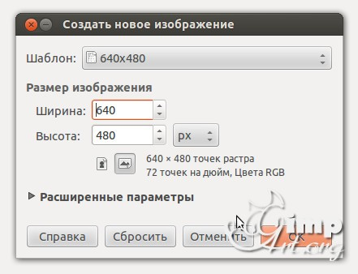
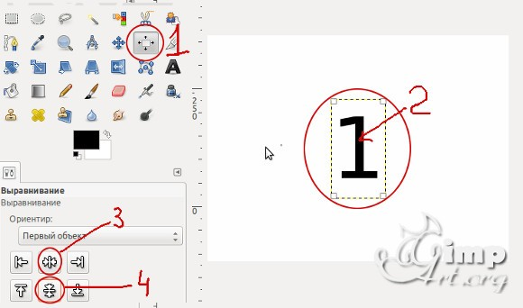
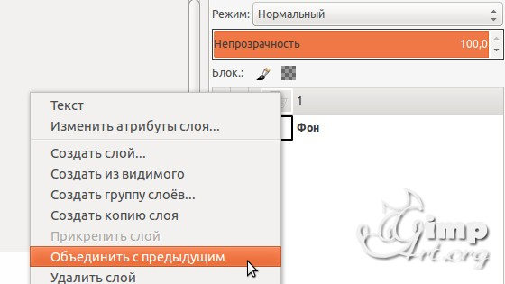
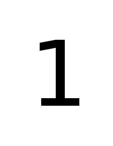

# Глава 8. Анимация

Хотя GIMP не был предназначен для создания
анимации, у него есть видеоредактирование
возможности, которые вы можете использовать для анимации логотипа,
например, или украсить веб-страницу. В этом
глава, мы сначала вводим некоторые простые анимации,
а затем в последующих разделах этого
главы, мы демонстрируем
более сложные анимации и показать, как манипулировать
существующих видеопоследовательностей в GIMP.

## Обучение: Анимированный текст

Предположим, для целей данного руководства, что
ваше имя - Кэрол, респектабельный, неандер-специфический
имя. Предположим, вы, Кэрол, хотите
украсить фотоальбом онлайн анимированным
логотип вашего имени. Буквы
ваше имя будет отображаться постепенно, а затем
переместитесь в положение. Как только ваше имя будет
появилась анимация.
Поскольку основное внимание в этом руководстве
анимация, логотип будет очень простым. Если
вам нравится, вы можете комбинировать эти методы анимации
с более продвинутыми логотипами, но
что такие комбинации часто приводят к
неудобный беспорядок.
Анимация - сделанные из последовательных рамок изображения. Один из
Способы создания анимации - это создание многослойного
изображение, в котором каждый слой является одним кадром.

### Первый метод: кадр за кадром

Самый простой способ создания кадров -
строить каждый по очереди вручную. Конечно,
этот метод также является самым громоздким и
возможно только для очень простых анимаций.
В этом уроке мы используем фоновый слой
в качестве фона анимации и перемещения только
буквы имени в последовательных слоях изображения.
Для начала создайте новое изображение 600 × 400
(CTRL + N). Заполните фон цветом
твой выбор. Для этого нажмите «Выбор цвета»
в панели инструментов,
выберите свой цвет, а затем нажмите CTRL +, чтобы
заполните слой цветом переднего плана. С другой стороны,
вы можете выбрать инструмент «Заполнение ковша»
(SHIFT + B) и нажмите, чтобы заполнить область.
Теперь выберите инструмент «Текст» (T). Выберите жирный
шрифт (в нашем случае мы выбрали DejaVu Sans Bold
Полуконденсированный), и установите размер до 100. Выберите
цвет текста, который явно проявляется против вашего
фоновый цвет.Первый щелчок соответствует верхнему левому
в углу коробки, содержащей первую букву. Если
вы щелкаете в другом месте изображения после ввода
первая буква, автоматически создается новый слой
для следующего письма, которое именно то, что вы
хотеть. После добавления всех букв ваше изображение
должен выглядеть так, как показано на рис. 6.1. Цвета, которые мы выбрали
для логотипа 2f91dc и f6ee11 в HTML
нотации.
Этот образ уже является простой анимацией. к
проверьте его, выберите Изображение: Фильтры> Анимация> Воспроизведение.
В открывшемся окне просто нажмите
PLAY, и вы увидите анимацию.
Почему это работает? Когда вы нажимаете PLAY,
GIMP показывает слои один за другим, а потому
текстовые слои имеют прозрачный фон,
буквы не закрывают фон,
или остальную часть логотипа, когда они появляются.
Чтобы завершить этот логотип, нажмите (SHIFT + CTRL + E)
и экспортировать его как изображение GIF. В диалоговом окне, которое
откройте, проверьте SAVE AS ANIMATION и снимите флажок
LOOP FOREVER.
Как поясняется в разделе «Форматы вывода» на странице
476, это создает файл, который вы можете отобразить в
браузер. После экспорта вашего логотипа в формате GIF,
вы можете использовать его в верхней части своей веб-страницы, для
пример.
Проверьте свою анимацию, открыв ее в своем
браузера, как правило, выбрав «Файл»> «Открыть»
или нажатие CTRL + O. Вы также можете включить
анимация на странице HTML с помощью .

### Второй способ: фильтрация всех слоев

Предыдущая анимация была простой. предполагать
вам нужно что-то более сложное. Здание
все кадры вручную потребуют много времени
и скучно - особенно, если вы хотите создать
гладкая анимация, которая требует много
кадры. Сделать такие анимации практичными
путь, вам нужна программа, которая автоматически генерирует
кадры из исходного изображения. GIMP
Анимационный пакет (GAP) делает именно это. Вы устанавливаете
он отдельно от GIMP, но этот процесс
простой (см. Приложение E для помощи в установке GAP).
Когда GAP установлен, меню под названием VIDEO
появляется в окне «Изображение» и два дополнительных
записи появляются в меню FILTERS: FILTER
ВСЕ СЛОИ и FILTERMACRO. Еще один инструмент
с GAP - изображение: фильтры> анимация
> Выбор в AnimImage, который аналогичен
для фильтрации всех слоев.

Для этой анимации текстовые слои должны быть
непрозрачный. Слияние текстового слоя с фоном
выбрав «Изображение»: «Слой»> «Объединить»
Вниз или щелчок правой кнопкой мыши по текстовому слою в
Диалоговое окно «Слои» и выберите «Слияние».
Анимация имеет 20 уровней, которые начинаются как
идентичные копии исходного логотипа. После
вы объединили текст с фоном,
измените имя слоя, например, на
CAROL # 1, дважды щелкнув имя слоя.
Затем нажмите кнопку DUPLICATE LAYER 19 раз
(Рис. 6.3) в диалоговом окне «Слои» (см. Рис. 6.4).
Теперь выберите «Изображение: фильтры»> «Фильтровать все слои».
Этот инструмент применяет фильтр ко всем слоям изображения.
Вы выбираете параметры фильтра для
первый и последний слои, а инструмент интерполирует
значения для слоев между ними.
Для нашего логотипа мы применяем фильтр размытия. Тип
слово размытие в поле поиска и нажмите
ПОИСК ПО BLURB.
Выберите plug-in-gauss и нажмите APPLY.
числовое поле и небольшая кривая рядом с APPLY
позволяют изменять скорость прогрессирования:
Он может быть однородным или медленным в начале
и быстрее в конце (для этого примера выберите
4) или наоборот (отрицательное число будет отменено
скорость). Когда появится следующий диалог,
установите большой радиус размытия, например 50 пикселей, как
показанном на рисунке 6.5.
Нажмите «ПРОДОЛЖИТЬ». Диалог, показанный на рисунке
Появится 6.6. Нажмите CONTINUE еще раз, и
появляется другое диалоговое окно, подобное рис. 6.5.
На этот раз установите размытие на 0 для окончательного кадра.
Нажмите «ОК». Теперь диалог, показанный на рисунке 6.7
появляется.
Затем вам нужно указать временный файл, где
анимация будет сохранена. Выберите каталог,
введите caroltemp.xcf (или любое ваше имя) и
затем нажмите CONTINUE еще раз. Процесс
занимает некоторое время, поскольку GIMP применяет
Гауссовский фильтр размытия до 20 слоев.
Как только этот процесс завершится, анимация
готов. Проверьте его, выбрав «Изображение: фильтры»> «Анимация»
> Воспроизведение. Когда анимация заканчивается
играя, он возвращается к началу.
Вы можете изменить это несколькими способами:
• Экспортировать анимацию как изображение GIF и
снимите флажок LOOP FOREVER.
• Измените продолжительность последнего кадра (то есть,
самый верхний слой); для этого дважды щелкните
имя слоя в диалоговом окне «Слои» и введите
(1000 мс) после имени. Обязательно включите
круглые скобки и пробел между
имя и продолжительность. Последний кадр теперь
отображает полную секунду, в то время как остальные
всего за 100 миллисекунд.
• Дублируйте верхний слой столько раз, сколько вам 
нужно

### Метод третий: движение по пути

При использовании FILTER ALL LAYERS вы можете
контролировать то, что делается для первого и последнего
Рамка. Кроме того, поскольку кадры представлены
по слоям, у вас не может быть многослойного
кадры. GAP предоставляет инструменты, которые вы можете использовать для
строить анимации с гораздо большим контролем.
В появившемся меню «Изображение: Видео»
когда вы установили плагин GAP, вы найдете
инструменты для создания анимаций с сохраненными фреймами
как отдельные файлы изображений.
Имена этих файлов изображений должны быть
form namexxxx.xcf, где имя - это имя, которое вы
дать анимации, а xxxx - это число, начинающееся
с 0001 и увеличивая последовательно
до последнего кадра. Количество цифр может
варьируются в зависимости от длины анимации.
Первый кадр очень короткой анимации может
быть названным 01. Более длинные анимации могут иметь 6, или
даже 10 цифр.
В этом примере представьте, что вы хотите создать
новая анимация, похожая на последние два, но немного
более сложный. На этот раз имя CAROL будет
растут все более и более
непрозрачный. Одновременно прямоугольная
рамка будет расти и становится непрозрачной, а затем
вращаться с вертикального положения, перпендикулярно
к тексту, к его горизонтальному положению, аккуратно
обрамление текста.
Сначала создайте модель анимации, которая
представляет собой трехслойное изображение. Создайте новое изображение 300 × 150
(CTRL + N) с тем же синим фоном
цвет. Еще раз добавьте текстовый слой с помощью
имя CAROL. Наконец, постройте рамку в том же
цвет как текст:
• Создайте новый прозрачный слой.
• С помощью инструмента «Прямоугольник» выберите
кадра текстового слоя.
• Применить Image: Выбрать> Border для этого выбора;
выберите ширину 5 для границы.
• Заполните выделение цветом переднего плана
(например, CTRL +,) и отменить выбор
(SHIFT + CTRL + A).Результат показан на рисунке 6.8. Держите это
изображение, открытое в GIMP.
Чтобы лучше организовать рабочее пространство, создайте
новая папка под названием Carol в любой директории
использовать для хранения изображений. Вы сохраните всю анимацию
кадров в этой новой папке.
Создайте первый кадр, щелкнув и перетащив
эскиз фонового слоя вашего
образ модели из диалогового окна «Слои» на панели инструментов.
Сохраните это изображение (SHIFT + CTRL + S) в
новую папку и назовите ее carol-0001.xcf. Это
фон первого кадра.
Затем дублируйте этот кадр. Простейший
метод заключается в использовании Image: Video> Duplicate
Frames. Появится диалоговое окно, показанное на рисунке 6.9.
Переместите ползунок N TIMES на 20 и щелкните
ОК. После того, как GIMP завершит работу, ничего не кажется
чтобы это произошло, но если вы проверите, вы увидите
новые кадры находятся в папке Кэрол. Хорошо быть
работая только с первым кадром, поэтому игнорируйте
новые рамки на данный момент.
Один из самых полезных инструментов в плагине GAP
is Image: Video> Move Path. Откройте первый
frame, carol-0001.xcf, а затем вызвать Move
Инструмент Путь. Как показано на рисунке 6.10, диалог
которая кажется довольно большой, но не паникуйте
этот урок, мы сосредоточимся только на нескольких его функциях.
Используйте инструмент MOVE PATH для добавления слоев, которые
взяты из открытого изображения (образ модели
в нашем случае), к кадрам анимации. Движение
применяется вдоль пути, определенного точками. В
каждой точке, вы можете применить преобразования, такие как
как режимы наложения, масштабирование, непрозрачность, вращение,
и перспективы к добавленному слою. Если вы добавите
несколько слоев одновременно, вы можете выбрать
как они взяты из образа модели.
Мы добавили числа к рис. 6.10, что
соответствуют номерам в тексте, которые помогут вам
с помощью следующих шагов. Выберите слой в
меню SOURCE IMAGE / LAYER из
те, которые находятся в открытых картинах (1). Первый,
выберите слой рамки. Потому что есть только
один слой, выберите NONE из STEPMODE
меню (2).После завершения обработки GIMP все кадры
анимации содержат те же три слоя
как образ модели, но с прогрессивными изменениями
к фрейму и текстовым слоям. Вы можете просмотреть это
анимации, выбрав изображение: Видео> Видеомагнитофон
Navigator и нажав кнопку PLAYBACK.
Предположим, вы хотите экспортировать это видео в качестве
GIF анимация. Для этого вам нужно преобразовать
эта анимация с несколькими изображениями на многослойную
один и объединить слои в каждом кадре. Вы
может сделать это автоматически, используя Image: Video>
Frames to Image, который вызывает диалог
как показано на рис. 6.13. Оставьте все как есть
и нажмите «ОК». И снова GIMP работает для
в то же время создавая новое многослойное изображение.
Измените продолжительность последнего кадра (
самый верхний слой) до 1000 мс путем ввода (1000 мс)
после имени слоя. Затем вы можете проверить свои
анимация с изображением: Фильтры> Анимация>
Воспроизведение или экспорт в виде файла GIF.

# Создание анимированного GIF вручную 

В начале этой главы мы создали анимацию
кадр за кадром как слои в одном изображении.
Ниже приведен общий список шагов для использования в качестве руководства
для создания похожих анимаций:

1. Создайте стационарный фон для
анимация.
2. Создайте еще один слой с объектом, который
будет двигаться; его можно вырезать из фотографии,
нарисованные с помощью инструментов рисования, или введенные в виде текста.
3. Для каждой новой позиции объекта дублируйте
предыдущего слоя и применить некоторое преобразование
к новому слою: перемещение, поворот или деформирование
объект, увеличить или уменьшить масштаб и т. д.
Будьте осторожны при выполнении этого или анимации
будет изменчивым.
4. Поскольку каждый новый слой должен заменить предыдущий
один, дублировать фоновый слой
один раз на предметный слой, пересекайте эти копии
между объектными слоями, а затем слить
каждый слой объекта с фоновым слоем.
5. Анимация завершена!

## 📝 Лабораторное задание

Цели выполнения лабораторного задания к __главе 8__:

- цель № 1:Создание простейшей анимации(анимированного текста)

### 🔴 Ход выполнения

#### 1. 

1.Открываем редактор и создаем новое изображение (640 — 480 пикселей)

2.Выбираем черный цвет переднего плана 

3. На панели инструментов выбираем «Текст». После этого щелкаем по рабочему холсту, чтобы активировать текстовую область и вводим с клавиатуры цифру «1»
4.После этого нам необходимо выронить цифру по центру слоя. Выбираем инструмент «Выравнивание» (1) и нажимаем один раз по цифре(2) для активации параметров. После этого поочередно нажимаем на пиктограммы (3) и (4)

5.Теперь объединим текстовый слой с фоновым. Для этого щелкаем один раз правой кнопкой мыши по верхнему слою и в открывшемся контекстовом меню выбираем «Объединить с предыдущим»

Аналогичным образом создадим еще два слоя, но на этот раз с цифрами «2» и «3»

6.Теперь, когда мы создали три слоя, пора приступить к анимации. Здесь стоит запомнить одно важное правило:

Слои в панели слоев — это наши кадры анимации. Нижний слой соответствует первому кадру т.д.
Для создания анимации перейдем в

«Фильтры — Анимация — Воспроизведение»

В открывшемся диалоговом окне нажнем на «Play»

